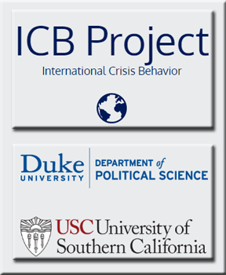

<BR><BR><BR>
```{r setup, include=FALSE}
knitr::opts_chunk$set(echo = TRUE)

# Empty Global Environment
# rm(list =ls())


```

<CENTER>

</CENTER>

<BR>

# Introduction

This is an structured exploration of the **The International Crisis Behavior 
(ICB) Project**  dataset, which can be found here: 
<http://sites.duke.edu/icbdata/data-collections/>. The aim of the ICB Project 
is to shed light on a pervasive phenomenon of world politics, military conflict, 
and sovereign state crises.


* **Key Goals**: (1) Explore key crisis attributes, interactions and 
relationships by ERA: (WW2, Cold War, Super Power), (2) explore the behaviors 
of Major (those with the highest frequencies) crisis "Actors" by ERA, (3) 
explore the USA crises during the Cold War ERA, and finally (4) explore some 
interesting multidimensional crisis characteristics of the dataset in unique 
ways.   


* The **prime objective** is to guide the reader through the exploration of the 
**four key goals** stated above, in a methodical, pragmatic fashion, in order to 
provide an appreciation for the richness (and gravity) of this dataset. 


* A **secondary objective** is to provide a structured framework in which the 
data could speak for itself and tell its own story. Every effort will be made to 
adhear to the spirit of this objective. 


```{r echo=FALSE, message=FALSE, warning=FALSE, Load_Packages}

# Load all of the packages and libraries needed

# install.packages('ggmap')
# install.packages("igraph")
# install.packages("vcd")
# install.packages("vcdExtra")
# install.packages("sqldf")
# install.packages("RH2")
# install.packages('extracat')
# install.packages('colorRamps')
# load packages and prepare data
# library(devtools)
# install_github("mbojan/alluvial")

# Import GGPlot2
library(ggplot2)


# Import plyr
library(plyr)

# Import dplyr
library(dplyr)

# Import geosphere
library(geosphere)

# Import maps
library(maps)

# Import ggmaps
library(ggmap)

# import mapproj
library(mapproj)

# import rworldmap
library(rworldmap)

# import rgdal
library(rgdal)

# Import tmap
library(tmap)

# Import rgdal
library(rgdal)

# Import igraph
library(igraph)

# Import extrafont
library(extrafont)

# Import VCD
library(vcd)

# Import vcdExtra
library(vcdExtra)

# Import gridExtra
library(gridExtra)

# Import grid
library(grid)

# Import SQLDF
library(sqldf)

# Import RH2
library(RH2)

# Import alluvial
library(alluvial)

```

<BR>

# Explorations of the Dataset Structure

This dataset consists of 470 unique crises, **95 attributes (variables), 1,036 
crisis actors (records)**, including 35 protracted conflicts, all from the 
period of **1918 to 2013**. 

* It is a rich dataset consisting almost entirely of **categorical** 
(no ordering) and **ordinal** (categorical but with ordering) data. 

I have augmented the dataset with a half dozen transformed variables to better 
facilitate the conveying of the information in some of the various plots used in 
the explorations.

There are **only a dozen attributes** of the 95 available which will be the 
**focus** of this exploration. These are listed in the section "Exploration of 
Selected Crisis Attributes".

**Below** is the structure of the dataset:

<BR>

```{r echo=FALSE, message=FALSE, warning=FALSE, Load_Data}

# Load the Data & Perform basic sanity checking

# URL: http://sites.duke.edu/icbdata/data-collections/
#
# Get ICB (International Crisis Behavior) DataSet from local CSV data file
icb_df <- read.csv('icb2v11.csv')


# Check the type of the data object
# typeof(icb_df)

# Check if the data object is a dataframe
# is.data.frame(icb_df)

# Check the number of rows
# nrow(icb_df)

# Check the number of columns
# ncol(icb_df)

# Check the column (variable) names 
# names(icb_df)

# Check the structure of the data
str(icb_df)

# check the top of the data
head(icb_df)

# Check the bottom of the data
# tail(icb_df)


#
# Convert the ICB DF to LOCAL data frame (LDF) to be used later
#
icb_ldf <- tbl_df(icb_df)

```


```{r echo=FALSE, message=FALSE, warning=FALSE, Data_Transformations}


###
### Process the Triggering Entity's transformation from NUMERIC to TEXT
### You must have Local DatFrame (LDF) created already.
###


# FUNCTION to swap out the numeric value of a triggering entity with it's text 
# equalivent (Non-Vectorized)
#
swap_numeric_to_txt <- function(trigent_var) {
  if (trigent_var == 995) { return("INTERNAL")}
  else if (trigent_var == 996) { return("NON_STATE_ACTOR")}
  else if (trigent_var == 997) { return("MULTI_STATE_ACTOR")}
  else if (trigent_var == 700) { return("AFG")}
  else if (trigent_var == 339) { return("ALB")}
  else if (trigent_var == 615) { return("ALG")}
  else if (trigent_var == 232) { return("AND")}
  else if (trigent_var == 540) { return("ANG")}
  else if (trigent_var == 058) { return("AAB")}
  else if (trigent_var == 160) { return("ARG")}
  else if (trigent_var == 371) { return("ARM")}
  else if (trigent_var == 900) { return("AUL")}
  else if (trigent_var == 305) { return("AUS")}
  else if (trigent_var == 373) { return("AZE")}
  else if (trigent_var == 031) { return("BHM")}
  else if (trigent_var == 692) { return("BAH")}
  else if (trigent_var == 771) { return("BNG")}
  else if (trigent_var == 053) { return("BAR")}
  else if (trigent_var == 370) { return("BLR")}
  else if (trigent_var == 211) { return("BEL")}
  else if (trigent_var == 080) { return("BLZ")}
  else if (trigent_var == 434) { return("BEN")}
  else if (trigent_var == 760) { return("BHU")}
  else if (trigent_var == 145) { return("BOL")}
  else if (trigent_var == 346) { return("BOS")}
  else if (trigent_var == 571) { return("BOT")}
  else if (trigent_var == 140) { return("BRA")}
  else if (trigent_var == 835) { return("BRU")}
  else if (trigent_var == 355) { return("BUL")}
  else if (trigent_var == 439) { return("BFO")}
  else if (trigent_var == 516) { return("BUI")}
  else if (trigent_var == 811) { return("CAM")}
  else if (trigent_var == 471) { return("CAO")}
  else if (trigent_var == 020) { return("CAN")}
  else if (trigent_var == 402) { return("CAP")}
  else if (trigent_var == 482) { return("CEN")}
  else if (trigent_var == 483) { return("CHA")}
  else if (trigent_var == 155) { return("CHL")}
  else if (trigent_var == 710) { return("CHN")}
  else if (trigent_var == 100) { return("COL")}
  else if (trigent_var == 581) { return("XXX")}
  else if (trigent_var == 484) { return("CON")}
  else if (trigent_var == 490) { return("DRC")}
  else if (trigent_var == 094) { return("COS")}
  else if (trigent_var == 437) { return("CDI")}
  else if (trigent_var == 344) { return("CRO")}
  else if (trigent_var == 040) { return("CUB")}
  else if (trigent_var == 352) { return("CYP")}
  else if (trigent_var == 316) { return("CZR")}
  else if (trigent_var == 315) { return("CZE")}
  else if (trigent_var == 390) { return("DEN")}
  else if (trigent_var == 522) { return("DJI")}
  else if (trigent_var == 054) { return("DMA")}
  else if (trigent_var == 042) { return("DOM")}
  else if (trigent_var == 130) { return("ECU")}
  else if (trigent_var == 651) { return("EGY")}
  else if (trigent_var == 092) { return("SAL")}
  else if (trigent_var == 411) { return("EQG")}
  else if (trigent_var == 531) { return("ERI")}
  else if (trigent_var == 366) { return("EST")}  
  else if (trigent_var == 530) { return("ETH")}
  else if (trigent_var == 987) { return("FSM")}
  else if (trigent_var == 950) { return("FIJ")}
  else if (trigent_var == 375) { return("FIN")}
  else if (trigent_var == 220) { return("FRN")} 
  else if (trigent_var == 219) { return("VFR")}
  else if (trigent_var == 480) { return("FWA")}
  else if (trigent_var == 481) { return("GAB")}
  else if (trigent_var == 420) { return("GAM")}
  else if (trigent_var == 372) { return("GRG")} 
  else if (trigent_var == 255) { return("GMY")}
  else if (trigent_var == 265) { return("GDR")} 
  else if (trigent_var == 260) { return("GFR")}
  else if (trigent_var == 452) { return("GHA")}
  else if (trigent_var == 350) { return("GRC")}
  else if (trigent_var == 055) { return("GRN")}
  else if (trigent_var == 090) { return("GUA")}
  else if (trigent_var == 438) { return("GUI")}
  else if (trigent_var == 404) { return("GNB")}
  else if (trigent_var == 110) { return("GUY")}
  else if (trigent_var == 041) { return("HAI")}
  else if (trigent_var == 671) { return("HIJ")}
  else if (trigent_var == 091) { return("HON")}
  else if (trigent_var == 310) { return("HUN")}
  else if (trigent_var == 395) { return("ICE")}
  else if (trigent_var == 750) { return("IND")}
  else if (trigent_var == 850) { return("INS")}
  else if (trigent_var == 630) { return("IRN")}
  else if (trigent_var == 645) { return("IRQ")}
  else if (trigent_var == 205) { return("IRE")}
  else if (trigent_var == 666) { return("ISR")}
  else if (trigent_var == 325) { return("ITA")}
  else if (trigent_var == 051) { return("JAM")}
  else if (trigent_var == 740) { return("JPN")}
  else if (trigent_var == 663) { return("JOR")}
  else if (trigent_var == 705) { return("KZK")}
  else if (trigent_var == 501) { return("KEN")}
  else if (trigent_var == 730) { return("KOR")}
  else if (trigent_var == 731) { return("PRK")}
  else if (trigent_var == 732) { return("ROK")}
  else if (trigent_var == 690) { return("KUW")}
  else if (trigent_var == 703) { return("KYR")}
  else if (trigent_var == 812) { return("LAO")}
  else if (trigent_var == 367) { return("LAT")}
  else if (trigent_var == 660) { return("LEB")}
  else if (trigent_var == 570) { return("LES")}
  else if (trigent_var == 450) { return("LBR")}
  else if (trigent_var == 620) { return("LIB")}
  else if (trigent_var == 223) { return("LIE")}
  else if (trigent_var == 368) { return("LIT")}
  else if (trigent_var == 212) { return("LUX")}
  else if (trigent_var == 343) { return("MAC")}
  else if (trigent_var == 580) { return("MAG")}
  else if (trigent_var == 553) { return("MAW")}
  else if (trigent_var == 820) { return("MAL")}
  else if (trigent_var == 781) { return("MAD")}
  else if (trigent_var == 432) { return("MLI")}
  else if (trigent_var == 338) { return("MLT")}
  else if (trigent_var == 983) { return("MSI")}
  else if (trigent_var == 435) { return("MAA")}
  else if (trigent_var == 590) { return("MAS")}
  else if (trigent_var == 070) { return("MEX")}
  else if (trigent_var == 359) { return("MLD")}
  else if (trigent_var == 221) { return("MNC")}
  else if (trigent_var == 712) { return("MON")}
  else if (trigent_var == 600) { return("MOR")}
  else if (trigent_var == 541) { return("MZM")}
  else if (trigent_var == 775) { return("MYA")}
  else if (trigent_var == 672) { return("NAJ")}
  else if (trigent_var == 565) { return("NAM")}
  else if (trigent_var == 790) { return("NEP")}
  else if (trigent_var == 210) { return("NTH")}
  else if (trigent_var == 920) { return("NEW")}
  else if (trigent_var == 093) { return("NIC")}
  else if (trigent_var == 436) { return("NIR")}
  else if (trigent_var == 475) { return("NIG")}
  else if (trigent_var == 385) { return("NOR")}
  else if (trigent_var == 698) { return("OMA")}
  else if (trigent_var == 770) { return("PAK")}
  else if (trigent_var == 986) { return("PAL")}
  else if (trigent_var == 095) { return("PAN")}
  else if (trigent_var == 910) { return("PNG")}
  else if (trigent_var == 150) { return("PAR")}
  else if (trigent_var == 135) { return("PER")}
  else if (trigent_var == 840) { return("PHI")}
  else if (trigent_var == 290) { return("POL")}
  else if (trigent_var == 235) { return("POR")}
  else if (trigent_var == 694) { return("QAT")}
  else if (trigent_var == 360) { return("RUM")}
  else if (trigent_var == 365) { return("RUS")}
  else if (trigent_var == 517) { return("RWA")}
  else if (trigent_var == 331) { return("SNM")}
  else if (trigent_var == 403) { return("STP")}
  else if (trigent_var == 670) { return("SAU")}
  else if (trigent_var == 433) { return("SEN")}
  else if (trigent_var == 591) { return("SEY")}
  else if (trigent_var == 451) { return("SIE")}
  else if (trigent_var == 830) { return("SIN")}
  else if (trigent_var == 317) { return("SLO")}
  else if (trigent_var == 349) { return("SLV")}
  else if (trigent_var == 940) { return("SOL")}
  else if (trigent_var == 520) { return("SOM")}
  else if (trigent_var == 560) { return("SSD")}
  else if (trigent_var == 230) { return("SPN")}
  else if (trigent_var == 780) { return("SRI")}
  else if (trigent_var == 060) { return("SKN")}
  else if (trigent_var == 056) { return("SLU")}
  else if (trigent_var == 057) { return("SVG")}
  else if (trigent_var == 625) { return("SUD")}
  else if (trigent_var == 115) { return("SUR")}
  else if (trigent_var == 572) { return("SWA")}
  else if (trigent_var == 380) { return("SWD")}
  else if (trigent_var == 225) { return("SWZ")}
  else if (trigent_var == 652) { return("SYR")}
  else if (trigent_var == 713) { return("TAW")}
  else if (trigent_var == 702) { return("TAJ")}
  else if (trigent_var == 510) { return("TAZ")}
  else if (trigent_var == 800) { return("THI")}
  else if (trigent_var == 711) { return("TBT")}
  else if (trigent_var == 461) { return("TOG")}
  else if (trigent_var == 052) { return("TRI")}
  else if (trigent_var == 616) { return("TUN")}
  else if (trigent_var == 640) { return("TUR")}
  else if (trigent_var == 701) { return("TKM")}
  else if (trigent_var == 500) { return("UGA")}
  else if (trigent_var == 369) { return("UKR")}
  else if (trigent_var == 696) { return("UAE")}
  else if (trigent_var == 200) { return("UKG")}
  else if (trigent_var == 002) { return("USA")}
  else if (trigent_var == 165) { return("URU")}
  else if (trigent_var == 704) { return("UZB")}
  else if (trigent_var == 935) { return("VAN")}
  else if (trigent_var == 101) { return("VEN")}
  else if (trigent_var == 816) { return("DRV")}
  else if (trigent_var == 817) { return("RVN")}
  else if (trigent_var == 605) { return("SPA")}
  else if (trigent_var == 990) { return("WSM")}
  else if (trigent_var == 678) { return("YEM")}
  else if (trigent_var == 680) { return("YPR")}
  else if (trigent_var == 345) { return("YUG")}
  else if (trigent_var == 551) { return("ZAM")}
  else if (trigent_var == 511) { return("ZAN")}
  else if (trigent_var == 552) { return("ZIM")}
  else return("NA")
} # End of Transform Function
 


# Extract the column "trigent" from the dataframe "icb_ldf" into the vector 
# variable "trigent.v"
trigent.v <- icb_ldf$trigent


# SAPPLY the function "swap_numeric_txt" to every value of the vector 
# "trigent.v" and store in vector- "sapply is a user-friendly version of 
# lapply, which by default returns a vector or matrix as appropriate."
#
trigent_actor.v <- sapply(trigent.v, swap_numeric_to_txt)


# Add the new column to the local dataframe "icb_ldf"
icb_ldf$trigent_actor <- trigent_actor.v


# Filter out outlier "NON_STATE_ACTOR" which dominates the "trigent_actor" 
# variable
no_outliers_NSA.df <- filter(icb_ldf, trigent_actor != "NON_STATE_ACTOR")


###
### Creates ERA Groups - segment the year trigger "yrtrig" variable into 
### three eras: (1) WW2_ERA, (2) COLD_WAR_ERA, (3) SUPERPOWER_ERA.
###

# FUNCTION to categorize the year into three eras: 
# (1) WW2_ERA, (2) COLD_WAR_ERA, (3) SUPERPOWER_ERA.
#
categorize_era <- function(year_var) {
  if (year_var <= 1945) { return("A_WW2_ERA")}
  else if (year_var > 1945 & year_var <= 1990) { return("B_COLD_WAR_ERA")}
  else if (year_var > 1990) { return("C_SUPERPOWER_ERA")}
  else return("NA")
}


# Extract the column "trigent" from the dataframe "icb_ldf" into the vector 
# variable "yrtrig.v"
yrtrig.v <- icb_ldf$yrtrig


# Spot Check it's Class
# class(yrtrig.v)

# Categorize each trigger year into one of three predefined ERA's:
# SAPPLY the function "categorize_era" to every value of the vector "yrtrig.v"
# "sapply is a user-friendly version of lapply by default returning a vector 
# or matrix if appropriate."
#
year_trigger_era.v <- sapply(yrtrig.v, categorize_era)

#
# Add the new column to the local dataframe
#

icb_ldf$year_trigger_era <- year_trigger_era.v


###
### DATA TRANSFORMATION SECTION: USA ACTOR - Segment the DF into USA  actor 
### Units per ERA.
###

# Isolate the various "actors" -  build a contingency table of the counts 
# at each combination of factor levels
actrs.t <- table(icb_ldf$actor)

# Isolate the various "Trigger Entities"
trigent.t <- table(icb_ldf$trigent_actor)


# Get the names of those with crisis counts greater than 15 
# (demarcation threshold for high )
# OUTPUT: "CHN" "EGY" "FRN" "GMY" "GRC" "IND" "IRQ" "ISR" "JPN" 
# "LIB" "PAK" "RUS" "SYR" "TUR" "UKG" "USA" "YUG"
actrs_high_freq_names.v <- names(actrs.t[actrs.t > 15])

# length(actrs_high_freq_names.v)

#
# Subset the dataframe into four ERA's: (1) All years, (2), WW2, (3) Cold 
# War, and (4) Superpower for those ACTORS who's crisis counts greater 
# than 15 (High Frequesnt Actors)
#

# ALL Years:
actrs_high_freq_all <- filter(icb_ldf, actor %in% actrs_high_freq_names.v & 
                                yrtrig > 1900 ) 

# World War II  ERA:  1900 - 1945
actrs_high_freq_WW2_ERA <- filter(icb_ldf, actor %in% 
                                    actrs_high_freq_names.v  & 
                                    year_trigger_era == "A_WW2_ERA")

# Cold War ERA: 1945 - 1990
actrs_high_freq_COLD_WAR_ERA <- filter(icb_ldf, actor %in% 
                                      actrs_high_freq_names.v  & 
                                      year_trigger_era == "B_COLD_WAR_ERA" )

# Superpower ERA: 1990 - 2015
actrs_high_freq_SUPERPOWER_ERA <- filter(icb_ldf, actor %in% 
                                      actrs_high_freq_names.v &  
                                      year_trigger_era == "C_SUPERPOWER_ERA" )

# USA ACTOR ONLY - COLDWAR:
USA_actor_CW.df <- filter(icb_ldf, actor == "USA" & year_trigger_era == 
                            "B_COLD_WAR_ERA")

# NOT USA ACTORs  - COLDWAR:
NOT_USA_actor_CW.df <- filter(icb_ldf, actor != "USA" & year_trigger_era == 
                                "B_COLD_WAR_ERA")

# USA TRIGGER ACTOR ONLY - COLDWAR:
USA_trigger_actor_CW.df <- filter(icb_ldf, trigent_actor == "USA" & 
                                    year_trigger_era == "B_COLD_WAR_ERA")

# NOT USA - Cold War ERA: 1945 - 1990
NOT_USA_actrs_high_freq_COLD_WAR_ERA.df <- filter(icb_ldf, actor != 
                              "USA" & actor %in% actrs_high_freq_names.v &  
                              year_trigger_era == "B_COLD_WAR_ERA" )


###
### Contingency Tables:
###

### USA ACTOR: (Where others cause the crisis for USA)
#
USA_actor_CW_table <- table(USA_actor_CW.df$actor)
USA_actor_CW_t_table <- table(USA_actor_CW.df$trigent_actor)


### USA Trigger ACTOR: (Where USA Causes the crisis for others)
#
USA_trigger_actor_CW_table <- table(USA_trigger_actor_CW.df$actor)
USA_trigger_actor_CW_t_table <- table(USA_trigger_actor_CW.df$trigent_actor)


###
### Name(s) Transformations: 
###

# ACTOR <- TRIGGER : (Where others cause the crisis for USA)
USA_actor_CW_t_names.v <- names(USA_actor_CW_t_table[USA_actor_CW_t_table > 0])

# RESULT:
# [1] "CAM"               "CHN"               "CUB"               "DRV"               
# "FRN"               "GRN"         
# [7] "GUA"               "IRN"               "IRQ"               "JOR"               
# "LIB"               "MULTI_STATE_ACTOR"
# [13] "NON_STATE_ACTOR"   "PAN"               "PRK"               "RUS"               
# "SYR"               "UKG"         


# TRIGGER <- ACTOR : (Where USA Causes the crisis for others)
USA_trigger_actor_CWnames.v <- 
  names(USA_trigger_actor_CW_table[USA_trigger_actor_CW_table > 0])

# RESULT:
# [1] "CAM" "CHN" "CUB" "DRV" "ETH" "GRN" "GUA" "IRN" "LIB" "NIC" 
# "PAN" "PRK" "RUS" "RVN" "SYR" "UKG"


###
### Data Transformations: USA CRISIS (Adversary) MAP (Cold War ERA) 
###


# Function to transform OUTCOM code to Full Text Version
transform_outcom_full_text <- function(code_var) {
  if (code_var == 1) {return("Victory")}
  else if (code_var == 2) {return("Compromise")}
  else if (code_var == 3) {return("stalemate")}
  else if (code_var == 4) {return("Defeat")}
  else return("NA")
}


#
# Extract the column "XXX" from the dataframe "icb_ldf" into the vector 
# variable "XXX.v"
#
outcom_variable.v <- icb_ldf$outcom

#
# "sapply is a user-friendly version of lapply by default returning a vector 
# or matrix if appropriate."
#
Crisis_Outcome_text.v <- sapply(outcom_variable.v, transform_outcom_full_text)

#
# Add the new column to the local dataframe 
#
icb_ldf$Crisis_Result <- Crisis_Outcome_text.v 


# Function to get the crisis by trigent_actor value:
#
get_crisis_by_trigent_acor <- function(trigent_actor_var) {
  return(sqldf(sprintf("select crisname, Crisis_Result from icb_ldf where 
            trigent_actor ='%s'  and actor = 'USA' ", trigent_actor_var) ))
} 


#
# Function to do actor code lookup to country name: (Not total dataset)
#
crise_code_to_name <- function(code) {
  switch(code,
    "CAM" = {writeLines("Cambodia")},
    "CHN" = {writeLines("China")},
    "CUB" = {writeLines("Cuba")},
    "DRV" = {writeLines("Vietnam")},
    "FRN" = {writeLines("France")},
    "GRN" = {writeLines("Grenada")},
    "GUA" = {writeLines("Guatemala")},
    "IRN" = {writeLines("Iran")},
    "IRQ" = {writeLines("Iraq")},
    "JOR" = {writeLines("Jordan")},
    "LIB" = {writeLines("Libya")},
    "MULTI_STATE_ACTOR" = {writeLines("MULTI_STATE_ACTOR")},
    "NON_STATE_ACTOR" = {writeLines("NON_STATE_ACTOR")},
    "PAN" = {writeLines("Panama")},
    "PRK" = {writeLines("Korea")},
    "RUS" = {writeLines("Russia")},
    "SYR" = {writeLines("Syria")},
    "UKG" = {writeLines("United Kingdom")},
    {print('default') }
  )
}


###
### Data Transformations for the ALLUVIAL Plots:
###


transform_allycap <- function(code_var) {
  if (code_var == 1) {return("None")}
  else if (code_var == 2) {return("INF")}
  else if (code_var == 3) {return("FOR")}
  else if (code_var == 4) {return("LEADR")}
  else return("NA")
}


transform_powsta <- function(code_var) {
  if (code_var == 1) {return("SML")}
  else if (code_var == 2) {return("MID")}
  else if (code_var == 3) {return("GRT")}
  else if (code_var == 4) {return("SUPR")}
  else return("NA")
}


transform_nuclear <- function(code_var) {
  if (code_var == 1) {return("None")}
  else if (code_var == 2) {return("Maybe")}
  else if (code_var == 3) {return("Has")}
  else if (code_var == 4) {return("Devlpd")}
  else return("NA")
}


transform_outcom <- function(code_var) {
  if (code_var == 1) {return("VICT")}
  else if (code_var == 2) {return("COMPRO")}
  else if (code_var == 3) {return("STALMT")}
  else if (code_var == 4) {return("DEFET")}
  else return("NA")
}


#
# Extract the column "XXX" from the dataframe "icb_ldf" into the 
# vector variable "XXX.v"
#
allycap.v <- icb_ldf$allycap
powsta.v <- icb_ldf$powsta
nuclear.v <- icb_ldf$nuclear
outcom.v <- icb_ldf$outcom


#
# "sapply is a user-friendly version of lapply by default returning 
# a vector or matrix if appropriate."
#
Alliance_Patterns.v <- sapply(allycap.v, transform_allycap)
Power_Status_Actor.v <- sapply(powsta.v, transform_powsta)
Nuclear_Capability.v <- sapply(nuclear.v, transform_nuclear)
Crisis_Outcome.v <- sapply(outcom.v, transform_outcom)

#
# Add the new column to the local dataframe 
#
icb_ldf$Alliances <- Alliance_Patterns.v
icb_ldf$Power_Status <- Power_Status_Actor.v
icb_ldf$NuclearCap <- Nuclear_Capability.v
icb_ldf$Result <- Crisis_Outcome.v 


###
### Data Transformations: USA Crisis List (Trigger, Crisis, Outcome)
###

transform_outcom_full_text <- function(code_var) {
  if (code_var == 1) {return("Victory")}
  else if (code_var == 2) {return("Compromise")}
  else if (code_var == 3) {return("stalemate")}
  else if (code_var == 4) {return("Defeat")}
  else return("NA")
}

#
# Extract the column "XXX" from the dataframe "icb_ldf" into the 
# vector variable "XXX.v"
#

outcom_variable.v <- icb_ldf$outcom

#
# "sapply is a user-friendly version of lapply by default returning 
# a vector or matrix if appropriate."
#

Crisis_Outcome_text.v <- sapply(outcom_variable.v, 
                                transform_outcom_full_text)

#
# Add the new column to the local dataframe 
#

icb_ldf$Crisis_Result <- Crisis_Outcome_text.v 


```

<BR>


# Validate Datset with external Sources

<CENTER>
```{r echo=FALSE, message=FALSE, warning=FALSE, VALIDATE_DATASET}


# Use DPLYR - FILTER to extract the Era records from the dataframe
WW2_ERA.v <- filter(icb_ldf, year_trigger_era == "A_WW2_ERA")
COLD_WAR_ERA.v <- filter(icb_ldf, year_trigger_era == "B_COLD_WAR_ERA")
SUPERPOWER_ERA.v <- filter(icb_ldf, year_trigger_era == "C_SUPERPOWER_ERA")

# Spot Check the counts of records:
# nrow(WW2_ERA.v)           # 260
# nrow(COLD_WAR_ERA.v)       # 598
# nrow(SUPERPOWER_ERA.v)     # 178


# External "Gut Check" of the data - does the peaks correspond to known 
# historical events from an external source?
# Show the count of "crises" per year 

ggplot(data=icb_ldf, aes(x = yrtrig)) +                # Total DataSet
# ggplot(data=WW2_ERA.v, aes(x = yrtrig)) +            # WW2_ERA
# ggplot(data=COLD_WAR_ERA.v, aes(x = yrtrig)) +       # COLD_WAR_ER
# ggplot(data=SUPERPOWER_ERA.v, aes(x = yrtrig)) +     # SUPERPOWER_ERA
  geom_bar(stat = "count") + 
  labs(x = "Years", y = "Crisis Counts") +
  scale_x_continuous("Trigger Year", breaks = c(1900, 1910, 1920, 1930, 1940, 
                          1950, 1960, 1970, 1980, 1990, 2000, 2010, 2020) ) +
  ggtitle('International Crises Trigger Year counts between 1900 and 2013') +
  # Russian Civil War
  geom_point(aes(x=1919, y=17), alpha = 0.5, size = 3, color = "red")    + 
  # World War 2
  geom_point(aes(x=1939, y=37.5), alpha = 0.5, size = 3, color = "blue") + 
  # Cold War Starts
  geom_point(aes(x=1945, y=18.5), alpha = 0.5, size = 3, color = "green4") + 
  # Arab-Israeli war 1947
  geom_point(aes(x=1947, y=20.5), alpha = 0.5, size = 3, color = 
               "darkgoldenrod3") + 
  # Berlin Crisis 1961
  geom_point(aes(x=1961, y=25.5), alpha = 0.5, size = 3, color = "purple") + 
  # The 1973 Arab-Israeli War
  geom_point(aes(x=1973, y=15.5), alpha = 0.5, size = 3, color = "coral3")  + 
  # Soviet-Afghan War
  geom_point(aes(x=1979, y=28.5), alpha = 0.5, size = 3, color = "black")  + 
  # 1987 Sino-Indian skirmish
  geom_point(aes(x=1987, y=25.5), alpha = 0.5, size = 3, color = "brown")  + 
  # Gulf War
  geom_point(aes(x=1990, y=18.5), alpha = 0.5, size = 3, color = "coral3")  + 
  # Kosovo War
  geom_point(aes(x=1998, y=22.5), alpha = 0.5, size = 3, color = "gold")  + 
  # Iraq War
  geom_point(aes(x=2003, y=12.5), alpha = 0.5, size = 3, color = 
               "mediumaquamarine")  + 
  # Syrian Civil War
  geom_point(aes(x=2011, y=14.5), alpha = 0.5, size = 3, color = 
               "mediumvioletred")    


```
</CENTER>

**Rationale:**

Part of the process of any exploratory data analysis is to perform a preliminary 
"gut check" of the data with an external source just to verify that it "makes 
sense", if even only in a cursory fashion. This section is that vetting process.


* **NOTE:** The colored dots on the bar chart correspond to the heightened key 
international crisis levels during the time period of 1918 - 2013. They **also** 
correspond to the key international crises below (left to right on the chart is 
top to bottom of the list). This is a reasonable "gut check" that the data is 
indeed not bad data. The table below was constructed via commonly found 
historical records of the time period.

* (1919) - Russian Civil War
* (1939) - World War 2 starts
* (1945) - Cold War Starts
* (1947) - The 1947 Arab-Israeli war
* (1961) - Berlin Crisis 
* (1973) - The 1973 Arab-Israeli War
* (1979) - Soviet-Afghan War
* (1987) - 1987 Sino-Indian skirmish
* (1990) - Gulf War
* (1998) - Kosovo War
* (2003) - Iraq War
* (2011) - Syrian Civil War


<BR>

# Exploration of Selected Crisis Attributes

<BR>

* There are **only a dozen** or so key attributes (of the 96 variables) explored 
over **three distinct ERAs** of the time period **1918 - 2013**. Those are 
illustrated in the following graph, listed below, and subsequently defined in 
the next section.


<CENTER>
```{r echo=FALSE, message=FALSE, warning=FALSE, fig.width=8, fig.height=8, CRISIS_ATTRIBUTES_EXPLORED }

###
### Selected ICB Project Attributes for Exploration: iGraph - Visual Exploration
###


# Create a vector of FROM id's all equal to "Crisis"
from.v = c("Crisis")[rep(1, 13)]

to.v = c("Crisis", "Crisis_Trigger", "Threat_Power_Status", "Major_Response", 
  "Coping_Technique", "Crisis_Outcome", "Crisis_Violence", "Political_Regime", 
  "Alliance_Patterns", "Nuclear_Capability", "Actor_Power_status", 
  "Crisis_Issue", "Gravest_Threat")

weight.v = c(1,1,1,1,1,1,1,1,1,1,1,1,1)

# vertice_size.v = c(5,1,1,1,1,1,1,1,1,1,1,1,1,1,1)
vertice_size.v = c(5,2,2,2,2,2,2,2,2,2,2,2,2)


# Create the relations DF:
icb_relations <- data.frame(from.v,to.v,weight.v)


# Load (DIRECTED) graph from data frame 
icb_graph <- graph.data.frame(icb_relations, directed=TRUE)

# removing the loops in the graph (if desired)
icb_graph <- simplify(icb_graph, remove.multiple = F, remove.loops = T) 


# Set node size based on audience size:
V(icb_graph)$size <- vertice_size.v*10


# Pretty print Graph:
plot(icb_graph, edge.arrow.size=.3, edge.curved=FALSE, edge.lty=2, 
  vertex.label.dist=.50, vertex.color="orange", vertex.frame.color="red", 
  vertex.label.font = 2, vertex.shape = "sphere", vertex.label.color="black", 
  vertex.label.cex=.8, vertex.label.degree=-pi/3, vertex.label.family="ARIAL",
  main = "Crisis Attributes Explored", sub = "Compared across 3 time 
  periods: WW2, Cold War, & SuperPower ERA's", 
  layout=layout.fruchterman.reingold(icb_graph, niter=10000, 
                                  area=90*vcount(icb_graph)^2) )


```
</CENTER>

<BR>

## Attributes List used in this exploration:


1. "Crisis Trigger"
2. "Crisis Issue"
3. "Major Response"
4. "Coping Technique"
5. "Actor Power Status 
6. "Threat Power Status"
7. "Crisis Violence"
8. "Political Regime"
9. "Alliance Patterns 
10. "Nuclear Capability"
11. "Gravest Threat"
12. "Crisis Outcome"


<BR>

## Definitions of Attributes:

* **NOTE**: It is prudent to remind the reader to peruse this section 
**carefully** as the precise definitions of these attributes and their values 
takes on special meanings in some cases, and will aide in understanding some of 
the explanatory graphs later on.


> **"Crisis Trigger"**

* The trigger or precipitating cause of a foreign policy crisis refers to the 
specific act, event or situational change which leads decision-makers to 
perceive a threat. A trigger may be initiated by: an adversary state; a 
non-state actor; or a group of states (military alliance).

<BR>

(1) Verbal act - protest, threat, accusation, demand, etc.

(2) Political act - subversion, alliance formation by adversaries, diplomatic 
sanctions, severance of diplomatic relations, violation of treaty 

(3) Economic act - embargo, dumping, nationalization of property, withholding 
of economic aid.

(4) External change - intelligence report, change in specific weapon, weapon 
system, offensive capability, change in global system or regional subsystem, 
challenge to legitimacy by international organization.

(5) Other non-violent act.

(6) Internal verbal or physical challenge to regime or elite - incitement by 
media, proclamation of new regime, fall of government, coup d'etat, sabotage 
act, terrorism, assassination, riot, demonstration, strike, arrest, martial law, 
execution, mutiny, revolt.

(7) Non-violent military act - show of force, war game or maneuvers, 
mobilization, movement of forces, change of force posture to offensive.

(8) Indirect violent act.

(9) Violent act - border clash, border crossing by limited force, invasion of 
air space, sinking of ship, sea-air incident, bombing of large target, 
large-scale military attack, war.


> **"Crisis Issue"**

*  This variable identifies the most important initial issue area of the crisis 
as perceived by the crisis actor.

<BR>

(1) Military-security - territory, borders, access to the sea, free navigation, 
irredentism, change in the military balance, military incidents, war.

(2) Political-diplomatic - sovereignty, hegemony, international status, change 
in international system, colonialism, cold war.

(3) Economic-developmental - treatment of property, raw material resources, oil, 
economic recession, economic pressure, currency problems.

(4) Cultural-status - ideology, threat to non-material values, internal 
problems, state of regime, population problems.

(5) Other.


> **"Major Response"**

* Once the decision makers of a state perceive the act/event/change which 
triggers its crisis, they will decide on an appropriate response. The major 
response is that specific action which captures the major thrust of its 
behavior.

<BR>

(1) No response-inaction.

(2) Verbal act - protest, threat, accusation, demand, etc. 

(3) Political act - subversion, alliance formation by adversaries, diplomatic 
sanctions, severance of diplomatic relations, violation of treaty threat to 
commit economic or military act..

(4) Economic act - embargo, dumping, nationalization of property, withholding 
of economic aid.

(5) Other non-violent act.

(6) Non-violent military act - declaration of war, show of force, war games or 
maneuvers, mobilization, movement of forces, with demand of forces, change of 
force posture to offensive, military aid.

(7) Multiple including non-violent military act.

(8) Violent military act - border clash, border crossing by limited force, 
invasion of air space, sinking of ship, sea-air incident, bombing of large 
target, large-scale military attack, war.

(9) Multiple including violent military act.


> **"Coping Technique"**

* States employ a variety of techniques to cope with foreign policy crises. 
This variable identifies the primary crisis management technique used by a 
crisis actor, as distinct from a specific act, which was the focus of the major 
response variable.

<BR>

(1) Negotiation - formal, informal, bilateral, multilateral, international, 
diplomatic exchange.

(2) Adjudication or arbitration.

(3) Mediation - by global or regional organization, ally, or alliance personnel.

(4) Multiple not including violence.

(5) Non-military pressure - e.g., withholding of promised economic aid.

(6) Non-violent military - physical acts (maneuvers, repositioning of forces); 
verbal acts (oral and written statements by authorized leaders threatening to 
use violence).

(7) Multiple including violence.

(8) Violence.


> **"Actor Power Status"**

* The power status of the actor (the one who has to respond to the crisis).

<BR>

(1) Small power.

(2) Middle power.

(3) Great power.

(4) Superpower.


> **"Threat Power Status"**

*  This variable assesses the power status of the state or other entity 
identified as the source of the threat.

<BR>

(1) Small power.

(2) Middle power.

(3) Great power.

(4) Superpower.


> **"Crisis Violence"**

* This variable identifies the extent of violence experienced by a crisis actor, 
regardless of its use or non-use as a crisis management technique.

<BR>

(1) No violence.

(2) Minor clashes .

(3) Serious clashes.

(4) Full-scale war .


> **"Political Regime"**

* This variable distinguishes between authoritarian and democratic regimes, as 
well as between civil and military regimes at the time of the crisis. Criteria 
for identifying democratic regimes are: competitive elections; pluralist 
representation in the legislature; several autonomous centers of authority in 
the political system; competitive parties; and a free press.

<BR>

(1) Democratic regime

(2) Civil authoritarian regime

(3) Military-direct rule

(4) Military-indirect rule

(5) Military dual authority


> **"Alliance Patterns"**

*  This variable identifies the type of alliance pattern which existed for the 
crisis actor at the time of its crisis.

<BR>

(1) Non-aligned or neutral.

(2) Informal alliance with superpower or great power.

(3) Formal alliance with superpower or great power.

(4) Alliance leader - superpower or great power.


> **"Nuclear Capability"**

* Did the crisis actor possess nuclear weapons or access to them at the time 
the crisis began?

<BR>

(1) No (foreseeable) nuclear capability - the actor did not possess a nuclear 
capability with any operational military significance when the crisis began; 
moreover, the international consensus at the time was that it could not develop 
or acquire such capability within five years.

(2) Foreseeable nuclear capability - the actor could develop or acquire 
operational nuclear military capability within five years of the beginning of 
the crisis.

(3) Possession of nuclear capability - the actor had nuclear military capability 
(weapons) and delivery means but no second-strike capability.

(4) Developed nuclear capability, with second strike capability superpower or 
great power with ability to absorb a first strike and retaliate.


> **"Gravest Threat"**

* This variable identifies the object of gravest threat at any time during the 
crisis, as perceived by the principal decision makers of the crisis actor. 

<BR>

(0) Economic threat.

(1) Limited military threat.

(2) Political threat - threat of overthrow of regime, change of institutions, 
replacement of elite, intervention in domestic politics, subversion .

(3) Territorial threat - threat of integration, annexation of part of a state's 
territory, separatism.

(4) Threat to influence in the international system or regional subsystem - 
threat of declining power in the global system and/or regional subsystem, 
diplomatic isolation, cessation of patron aid .

(5) Threat of grave damage - threat of large casualties in war, mass bombings.

(6) Threat to existence - threat to survival of population, of genocide, threat 
to existence of entity, of total annexation, colonial rule, occupation.

(7) Other.


> **"Crisis Outcome"**

* This variable deals with the content of crisis termination. Did a crisis actor 
yield? Did it triumph? Was a compromise reached? Was there a blurred outcome 
regarding goal achievement? The outcome is indicated from the perspective of a 
specific actor. The values which fall under the categories listed below should 
be thought of in terms of achievement/nonachievement of basic goals(s) by a 
crisis actor in the context of a specific crisis.

<BR>

(1) Victory - achievement of basic goal(s); the crisis actor defeated a 
threatening adversary by counter-threats .

(2) Compromise - partial achievement of basic goal(s).

(3) Stalemate - no effect on basic goal(s); no clear outcome to the crisis; no 
change in the situation.

(4) Defeat - non-achievement of basic goal(s); the crisis actor yielded or 
surrendered when an adversary threatened basic values.

(5) Other.

<BR>

## Exploration of Crisis Attributes by ERA (WW2, Cold War, Super Power):

This section explores key crisis attributes from the entire dataset segmented 
by the three ERA's. Each attribute is examined individually to highlight it's 
nuances, gravity, patterns, and trends.


* **NOTE**: It si worth articulating that this section is about **general** 
trends, not specific interactions (discussed later on), so most of the analysis 
is quite general in nature, will cover all of the participants, over all of the 
years in question. 

<BR>

### Crisis Participants (Actors)
<CENTER>
```{r echo=FALSE, message=FALSE, warning=FALSE, PARTICIPANTS_SINGLE_ATTRIBUTES}

#
# Conflict Participants -> ACTORS
#

# Plot barchart of COUNTRY ID - "actors", see who has the highest counts over 
# the time period. This is a Big ugly plot that only shows that some actors 
# are more active that others.
#
# ggplot(data=icb_ldf, aes(x = factor(actor), fill = factor(actor))) +
actors_plt <- ggplot(data=icb_ldf, aes(x = factor(actor))) +
  geom_bar(stat = "count") +
  # coord_flip() +
  ggtitle('Actors => Conflict Participants') +
  xlab("Countries Involved") +
  ylab("Number of Crisis (Counts) ") +
  theme(plot.title = element_text(family = "Arial", color="Red", face="bold", 
                                  size=12)) +
  theme(strip.background = element_rect(fill="orange")) +
  theme(axis.ticks=element_blank(),  axis.text.x=element_blank()) +
  theme(strip.text.x = element_text(colour = 'blue', size = 9, face = "bold")) +
  theme(axis.title = element_text(family = "Arial", color="blue", face="bold", 
                                  size=12)) +
  facet_wrap(~ year_trigger_era) +
  geom_hline(yintercept = 10, colour="red", linetype = "longdash") +
  geom_hline(yintercept = 25, colour="blue", linetype = "longdash") +
  theme(aspect.ratio=1)

actors_plt


```
</CENTER>


* **Major Actors** (Countries with the highest crisis counts) Worldwide

| Country         | Country        | Country         |  Country        |
| :-------------: |:-------------: | :-------------: | :-------------: |
|China|Egypt|France|Germany|
|Greece|India|Iraq|Israel|
|Japan|Libya|Pakistan|Russia|
|Syria|Turkey|UK|USA|
|Yugoslavia|||


**ANALYSIS**: 

* CAVEAT: These next two graphs obscure a good bit of the data on the X axis, 
that is OK because the key takeaways are simply observing the simple macro 
trends that are discussed below.

* The key observation from this graph is that the "frequency" of crises and 
actors increases significantly during the cold war period, and then sharply 
subsides during the superpower period. There is significant instances of crises 
during WW2 (which is expected) but the increase during the Cold war period is 
notable, as in the steep decline in the following era.

* There is an **outlier phenomenon* (a legitimate one) in the cold war era which 
will continue to manifest itself through out this exploration and should be 
noted. That outlier is the influence of **"Non-State Actors"** (eg: terrorist 
groups) and **"Multi-State Actors"** (alliances of nations) in the crisis 
activities. Since they are not specific sovereign states, they are coded as 
such, and their presence tends to overshadow the activities of the other single 
state actors.

* NOTE: For highlighting purposes, observe the rise and fall of crisis frequency 
between the red and blue lines in the graphs.


<BR>

### Crisis Belligerents (Trigents)
<CENTER>
```{r echo=FALSE, message=FALSE, warning=FALSE, BELLIGERENTS_SINGLE_ATTRIBUTES}


#
# Conflict Participants ->  Belligerents (Trigger Entities)
#

# Plot barchart of Triggering Entities - "trigent_actors", see who has the 
# highest counts over the time period. A Big ugly plot that only shows that 
# some Belligerents are more active that others. 
# 
# NOTE: OUTLIER / ANOMOLY present. SPOILER ALERT - this is a clue!
#
belligerents_plt <- ggplot(data=icb_ldf, aes(x = factor(trigent_actor) )) +
  geom_bar(stat = "count") +
  ggtitle('Trigger Entities -> Conflict Belligerents') +
  xlab("Countries Involved") +
  ylab("Number of Crisis (Counts) ") +
  theme(plot.title = element_text(family = "Arial", color="Red", face="bold", 
                                  size=12)) +
  theme(strip.background = element_rect(fill="orange")) +
  theme(axis.ticks=element_blank(),  axis.text.x=element_blank()) +
  theme(strip.text.x = element_text(colour = 'blue', size = 9, face = "bold")) +
  theme(axis.title = element_text(family = "Arial", color="blue", face="bold", 
                                  size=12)) +
  facet_wrap(~ year_trigger_era)  +
  geom_hline(yintercept = 10, colour="red", linetype = "longdash") +
  geom_hline(yintercept = 25, colour="blue", linetype = "longdash") +
  theme(aspect.ratio=1)

belligerents_plt


```
</CENTER>


* **Major Trigger Actors** (Belligerents with the highest crisis counts) 
Worldwide


| Country         | Country        | Country         |  Country        |
| :-------------: |:-------------: | :-------------: | :-------------: |
|China|France|Germany|India|
|Iran|Iraq|Israel|Italy|
|Japan|Libya|North Korea|Russia|
|South Sudan|Turkey|UK|USA|
|Yugoslavia||||


**ANALYSIS**: 

* The same overall trends exist for the Crisis Belligerents (causal actors) as 
the actors (indicating a correlation) except that they are slightly muted. Even 
so, it is still worth noting.

<BR>

### Trigger of the Crisis
<CENTER>
```{r echo=FALSE, message=FALSE, warning=FALSE, TRIGGER_SINGLE_ATTRIBUTES }


#
# EXPLORATION: - Trigger of the Crisis : (TRIGGR)
#

trigger_plt <- ggplot(data=icb_ldf, aes(x = factor(triggr), fill = factor(triggr) 
                                        )) +
  scale_fill_discrete(name="Act", labels=c("Verbal Act","Political Act",
      "Economic Act","External Change","Other Non-Violent Act",
      "Internal Regime Challenge","Non-Violent Military Act",
      "Indirect Violent Act","Violent Act")) +
  coord_flip() +
  geom_bar(stat = "count") + 
  ggtitle('Trigger of Crisis.') + 
  xlab("Trigger of Crisis") +
  ylab("Counts") +
  theme(plot.title = element_text(family = "Arial", color="Red", face="bold", 
                                  size=12)) +
  theme(strip.background = element_rect(fill="orange")) +
  theme(strip.text.x = element_text(colour = 'blue', size = 9, face = "bold")) +
  theme(axis.title = element_text(family = "Arial", color="blue", face="bold", 
                                  size=12)) +
  theme(legend.title = element_text(colour="black", size=12, face="bold")) +
  theme(legend.position="bottom") +
  theme(legend.text = element_text(colour="black", size=9)) +
  facet_wrap(~ year_trigger_era)  +
  theme(aspect.ratio=1)

trigger_plt

```
</CENTER>

**ANALYSIS**: 

* Violent acts and political acts continue to dominate in roughly the same 
frequency proportions in each key era, except that their (as well as all of the 
others) frequency during the cold war is greatly pronounced. 

* Notice that in the superpower era, overall trigger activity reduces 
significantly (perhaps due to advanced military and nuclear arms proliferation).

<BR>

### Issue of the crisis
<CENTER>
```{r echo=FALSE, message=FALSE, warning=FALSE, ISSUE_SINGLE_ATTRIBUTES }

#
# EXPLORATION: - ISSUE (Issue of Crisis) : NOTE - GREY is Missing Data.
#

issue_plt <- ggplot(data=icb_ldf, aes(x=factor(issue), fill = factor(issue))) +
  scale_fill_discrete(name="Crisis Issue", labels=c("Military-Security",
    "Political-Diplomatic", "Economic-Developmental", "Cultural-Status", 
    "Other")) +
  coord_flip() +
  geom_bar(stat = "count") + 
  ggtitle('Issue of Crisis.') + 
  xlab("Issue of Crisis") +
  ylab("Counts") +
  theme(plot.title = element_text(family = "Arial", color="Red", face="bold",
                                  size=12)) +
  theme(strip.background = element_rect(fill="orange")) +
  theme(strip.text.x = element_text(colour = 'blue', size = 9, face = "bold")) +
  theme(axis.title = element_text(family = "Arial", color="blue", face="bold", 
                                  size=12)) +
  theme(legend.title = element_text(colour="black", size=12, face="bold")) +
  theme(legend.position="bottom") +
  theme(legend.text = element_text(colour="black", size=9)) +
  facet_wrap(~ year_trigger_era)  +
  theme(aspect.ratio=1)

issue_plt


```
</CENTER>

**ANALYSIS**: 

* The dominant crisis issue across the eras is military-security followed by 
political-diplomatic. The same trend of a sharp increase during the cold war era 
is evident along with the subsequent sharp decline in the super power era.


<BR>


### Crisis Management I: Major Response to Crisis Trigger
<CENTER>
```{r echo=FALSE, message=FALSE, warning=FALSE, MAJOR_RESPONSE_ATTRIBUTES}

#
# EXPLORATION: - Crisis Management I: Major Response to Crisis Trigger (MAJRES)
#

major_response_plt <- ggplot(data=icb_ldf, aes(x = factor(majres), fill = 
                                                 factor(majres))) +
  geom_bar(stat = "count") +
  # coord_flip() +
  ggtitle('Major Response to Crisis ') +
  scale_fill_discrete(name="Resp: ", labels=c("Inaction","Verbal", "Political", 
      "Economic", "Other non-violent", "Non-violent Military", 
      "Multiple incl Non-violent Military", "Violent Military", 
      "Multiple Incl violent Military"))  + 
  xlab("Major Response") +
  ylab("Counts") +
  theme(plot.title = element_text(family = "Arial", color="Red", face="bold", 
                                  size=12)) +
  theme(strip.background = element_rect(fill="orange")) +
  theme(strip.text.x = element_text(colour = 'blue', size = 9, face="bold")) +
  theme(axis.title = element_text(family = "Arial", color="blue", face="bold", 
                                  size=12)) +
  theme(legend.title = element_text(colour="black", size=12, face="bold")) +
  theme(legend.position="bottom") +
  theme(legend.text = element_text(colour="black", size=9)) +
  facet_wrap(~ year_trigger_era)  +
  theme(aspect.ratio=1)

major_response_plt

```
</CENTER>

**ANALYSIS**: 

* When it comes to the major responses of a crisis, the overall proportions and 
trends are the same between eras (sharp increases during the cold war with 
notable declines during the superpower era), but within the cold war era, the 
increases of political, non-violent military, and violent military are 
"significantly"" increased. 

* A quick look back into the various US-Russian tension levels, the introduction 
of nuclear weapons, and the struggles for international dominance between two 
emerging superpowers might lend understanding to the movements of those specific 
parameters.

* One nuance that should be noted is the emergence of "Economic" response to 
crises as a viable alternative along with "Verbal" options in the superpower 
period. I wonder if the emergence of intertwined economies and advanced military 
weapons could account for the appearance of these?

<BR>

### Crisis Management II: Principal Coping Technique
<CENTER>
```{r echo=FALSE, message=FALSE, warning=FALSE, PRINCIPLE_TECHNOQUE_ATTRIBUTES}

#
# EXPLORATION: - Crisis Management II: Principal Coping Technique (CRISMG)
#

principle_technique_plt <- ggplot(data=icb_ldf, aes(x = factor(crismg), fill = 
                                                      factor(crismg) )) +
  geom_bar(stat = "count") +
  coord_flip() +
  ggtitle('Principal Coping Technique used') +
   scale_fill_discrete(name="Tech: ", labels=c("Negotiation",
    "Adjudication / Arbitration", "Mediation", "Multiple - no Violence", 
    "Non-Military Pressure", "Non-violent Military", "Multiple incl Violence", 
    "Violent Military", "Violence")) +
  xlab("Principal Technique") +
  ylab("Counts") +
  theme(plot.title = element_text(family = "Arial", color="Red", face="bold", 
                                  size=12)) +
  theme(strip.background = element_rect(fill="orange")) +
  theme(strip.text.x = element_text(colour = 'blue', size = 9, face ="bold")) +
  theme(axis.title = element_text(family = "Arial", color="blue", face="bold", 
                                  size=12)) +
  theme(legend.title = element_text(colour="black", size=12, face="bold")) +
  theme(legend.position="bottom") +
  theme(legend.text = element_text(colour="black", size=9)) +
  facet_wrap(~ year_trigger_era)  +
  theme(aspect.ratio=1)

principle_technique_plt

```
</CENTER>

**ANALYSIS**: 

* Not surprisingly, the combination of violence and negotiation (in it's many 
forms) dominate principle coping techniques during all eras (as well as all of 
written history). Again, the frequencies of the instances are significantly 
higher in the cord war era, which is expected considering the history of the 
time period.

* It should be noted that non-violent techniques also increased during the cold 
war indicating that in the mix of events, there were some cooler heads 
prevailing. The would make good sense, given the advancement and proliferation 
of weapons of mass distruction.

<BR>

### Crisis Outcome (Win, Lose, Draw)
<CENTER>
```{r echo=FALSE, message=FALSE, warning=FALSE, OUTCOME_SINGLE_ATTRIBUTES }

#
# EXPLORATION: - Content of Crisis Outcome (OUTCOM) (Actor Outcome - win, 
# lose, draw.)
#

outcome_plt <- ggplot(data=icb_ldf, aes(x = factor(outcom), fill = 
                                          factor(outcom) )) +
  scale_fill_discrete(name="Crisis Outcome", labels=c("Victory","Compromise", 
                                          "stalemate", "Defeat", "Other")) +
  geom_bar(stat = "count") + 
  # coord_flip() +
  ggtitle('Outcome for Actor in Crisis.') +
  xlab("Crisis Outcome") +
  ylab("Counts") +
  theme(plot.title = element_text(family = "Arial", color="Red", face="bold", 
                                  size=12)) +
  theme(strip.background = element_rect(fill="orange")) +
  theme(strip.text.x = element_text(colour = 'blue', size = 9, face="bold")) +
  theme(axis.title = element_text(family = "Arial", color="blue", face="bold", 
                                  size=12)) +
  theme(legend.title = element_text(colour="black", size=12, face="bold")) +
  theme(legend.position="bottom") +
  theme(legend.text = element_text(colour="black", size=9)) +
  facet_wrap(~ year_trigger_era)  +
  theme(aspect.ratio=1)

outcome_plt


```
</CENTER>

**ANALYSIS**: 

* In the WW2 era, outcomes of victory or defeat dominate all other categories 
with compromise emerging as a distant third option. 

* In the Cold war era, this mix changes significantly with victories dominating 
the frequency chart. It is interesting to note that Stalemates rises 
significantly in this era along with compromises and defeats. I'd argue that 
this is also a function of the power struggles of that period between the 
US-USSR, the advancement of WMD's, and jockying for geopolitical / economic 
dominance. 

* In the superpower era, the levels return to nearly of the WW2 era, but with a 
unique phenomenon of compromise surpassing all of the others for the first time. 
Again, it could be argued that because of the gravity of nuclear weapons, 
compromise is a much preferred alternative to the gravity of the other outcomes.

<BR>

### Power Status of Actor
<CENTER>
```{r echo=FALSE, message=FALSE, warning=FALSE, POWER_STATUS_ACTOR_ATTRIBUTES }

#
# EXPLORATION: - POWSTA (Power Status of Actor)
#

power_status_actor_plt <- ggplot(data=icb_ldf, aes(x = factor(powsta), fill = 
                                                     factor(powsta) )) +
  geom_bar(stat = "count") +
  # coord_flip() +
  scale_fill_discrete(name="Power Status of Actor", labels=c("Small Power",
                            "Middle Power", "Great Power", "Super Power")) +
  ggtitle('Power Status of Actor') +
  xlab("Power Status") +
  ylab("Counts") +
  theme(plot.title = element_text(family = "Arial", color="Red", face="bold", 
                                  size=12)) +
  theme(strip.background = element_rect(fill="orange")) +
  theme(strip.text.x = element_text(colour = 'blue', size = 9, face="bold")) +
  theme(axis.title = element_text(family = "Arial", color="blue", face="bold", 
                                  size=12)) +
  theme(legend.title = element_text(colour="black", size=12, face="bold")) +
  theme(legend.position="bottom") +
  theme(legend.text = element_text(colour="black", size=9)) +
  facet_wrap(~ year_trigger_era)  +
  theme(aspect.ratio=1)

power_status_actor_plt


```
</CENTER>

**ANALYSIS**: 

* The distribution of Actor power status makes sense given the eras in 
consideration, and that changes accordingly over time. In the WW2 era, there 
were a lot of small and great powers with a few middle powers emerging. After 
WW2, in the cold war era, that mix changed significantly both in gross numbers 
of small and middle powers and the increase of great powers, plus the emergence 
of super powers for the first time in history. Those same proportions continue 
in the superpower era but the frequency is greatly reduced, which is notable 
given the backdrop of history in that period.


<BR>


### Power Status of Threat
<CENTER>
```{r echo=FALSE, message=FALSE, warning=FALSE, POWER_STATUS_THREAT_ATTRIBUTES}

#
# EXPLORATION: - SOUTHPOW (Power Status of Threat)
#

power_status_threat_plt <- ggplot(data=icb_ldf, aes(x = factor(southpow), fill= 
                                                      factor(southpow) )) +
  geom_bar(stat = "count") +
  # coord_flip() +
  scale_fill_discrete(name="Power Status of Threat", labels=c("Small Power",
                              "Middle Power", "Great Power", "Super Power")) +
  ggtitle('Power Status of Threat') +
  xlab("Power Status") +
  ylab("Counts") +
  theme(plot.title = element_text(family = "Arial", color="Red", face="bold", 
                                  size=12)) +
  theme(strip.background = element_rect(fill="orange")) +
  theme(strip.text.x = element_text(colour = 'blue', size = 9, face="bold")) +
  theme(axis.title = element_text(family = "Arial", color="blue", face="bold", 
                                  size=12)) +
  theme(legend.title = element_text(colour="black", size=12, face="bold")) +
  theme(legend.position="bottom") +
  theme(legend.text = element_text(colour="black", size=9)) +
  facet_wrap(~ year_trigger_era)  +
  theme(aspect.ratio=1)

power_status_threat_plt

```
</CENTER>

**ANALYSIS**: 

* The power status of threats during the WW2 era is what one would expect, 
dominated by great powers with an introduction of superpowers (at the end of 
the war). 

* The cold war era is different, the power status of the threats are dominated 
by small and middle powers with the great and super powers also rising in 
frequency, but less than the small and middle powers. 

* By the time the superpower era takes hold the overall frequency is reduced 
substantially, but of that, small and medium threat powers still dominate in 
frequency. I wonder if the nuclear stalemate among the maturing of superpowers 
has made the relevancy of conventional weapons and localized conflicts 
significant again?


<BR>

### Violence experiences by Crisis Actor
<CENTER>
```{r echo=FALSE, message=FALSE, warning=FALSE, VIOLENCE_SINGLE_ATTRIBUTES }

#
# EXPLORATION: - VIOL (Violence associated with Crises Actor.)
# the extent of violence experienced BY a crisis actor
#

violence_plt <- ggplot(data=icb_ldf, aes(x=factor(viol), fill=factor(viol) )) +
  scale_fill_discrete(name="Violence Levels", labels=c("No Violence",
                      "Minor Clashes", "Serious Clashes", "Full-Scale War")) +
  geom_bar(stat = "count") + 
  coord_flip() +
  ggtitle('Violence experienced by Crises Actor.') +
  xlab("Violence Level") +
  ylab("Counts") +
  theme(plot.title = element_text(family = "Arial", color="Red", face="bold", 
                                  size=12)) +
  theme(strip.background = element_rect(fill="orange")) +
  theme(strip.text.x = element_text(colour = 'blue', size = 9, face="bold")) +
  theme(axis.title = element_text(family = "Arial", color="blue", face="bold", 
                                  size=12)) +
  theme(legend.title = element_text(colour="black", size=12, face="bold")) +
  theme(legend.position="bottom") +
  theme(legend.text = element_text(colour="black", size=9)) +
  facet_wrap(~ year_trigger_era)  +
  theme(aspect.ratio=1)

violence_plt

```
</CENTER>

**ANALYSIS**: 

* One trend that is notable is that in the WW2 and cold war eras, non-violence 
levels were higher than all others significantly. That does "not" continue in 
the superpower era, where there is equal frequencies of non-violence as other 
forms of violence. This is not a particularly encouraging macro trend to 
observe, even though the overall levels are lower in the superpower era than 
the cold war, one would hope to see non-violence levels higher than the others.

<BR>

### Political Regime of Crises Actor.
<CENTER>
```{r echo=FALSE, message=FALSE, warning=FALSE, POLITICAL_REGIME_ATTRIBUTES }

#
# EXPLORATION: - REGIME (Political Regime of Crises Actor.)
#

regime_plt <- ggplot(data=icb_ldf,aes(x=factor(regime), fill=factor(regime))) +
scale_fill_discrete(name="Regime",labels=c("Democratic","Civil Authoritarian", 
          "Military-Direct", "Military-Indirect", "Military Dual Authority")) +
  geom_bar(stat = "count") + 
  ggtitle('Political Regime of Crises Actor.') +
  xlab("Political Regime") +
  ylab("Counts") +
  theme(plot.title = element_text(family = "Arial", color="Red", face="bold", 
                                  size=12)) +
  theme(strip.background = element_rect(fill="orange")) +
  theme(strip.text.x = element_text(colour = 'blue', size = 9, face ="bold")) +
  theme(axis.title = element_text(family = "Arial", color="blue", face="bold", 
                                  size=12)) +
  theme(legend.title = element_text(colour="black", size=12, face="bold")) +
  theme(legend.position="bottom") +
  theme(legend.text = element_text(colour="black", size=9)) +
  facet_wrap(~ year_trigger_era)  +
  theme(aspect.ratio=1)

regime_plt


```
</CENTER>

**ANALYSIS**: 

* I find this particular analysis interesting in that democracies along with 
civil authoritarian regimes are most often embroiled with interstate crises as 
opposed to some form of a military government. That trend goes counter to the 
conventional narrative about democracies and civil authoritarian regimes, 
although historically it has definitely been the case that democracies and civil 
authorities are more prone to get involved in conflicts and then stay involved 
until the very end. 


<BR>


### Gravest threat during crisis.
<CENTER>
```{r echo=FALSE, message=FALSE, warning=FALSE, GRAVEST_THREAT_ATTRIBUTES}

#
# EXPLORATION: - GRAVITY (Gravest threat during crisis.)
#

regime_plt <- ggplot(data=icb_ldf, aes(x=factor(gravty),fill=factor(gravty)))+
scale_fill_discrete(name="Threat Level",labels=c("Economic","Limited Military", 
        "Political", "Territorial", "Threat to Influence", "Grave Damage",
        "Threat to Existence")) +
  geom_bar(stat = "count") + 
  ggtitle('Gravest threat during crisis.') +
  xlab("Threat level") +
  ylab("Counts") +
  theme(plot.title = element_text(family = "Arial", color="Red", face="bold", 
                                  size=12)) +
  theme(strip.background = element_rect(fill="orange")) +
  theme(strip.text.x = element_text(colour = 'blue', size = 9, face="bold")) +
  theme(axis.title = element_text(family = "Arial", color="blue", face="bold", 
                                  size=12)) +
  theme(legend.title = element_text(colour="black", size=12, face="bold")) +
  theme(legend.position="bottom") +
  theme(legend.text = element_text(colour="black", size=9)) +
  facet_wrap(~ year_trigger_era)  +
  theme(aspect.ratio=1)

regime_plt


```
</CENTER>

**ANALYSIS**: 

* The WW2 era distribution of gravest threats is predictible with the highest 
frequency of threats being to a states actual existence, along with 
corresponding territorial and grave damage threats. 

* The cold war era saw a dramatic rise in political, territorial, and influence 
threats, and a continued rise in grave damage. This (again) is understandable 
given the introduction of nuclear WMD's and the capabilities of intercontinental 
delivery systems of those weapons move the crisis focus to other less grave 
areas.

* Continuing the trend into the Superpower era, the overall levels drop 
significantly and we see a rise in limited military threats slightly 
overshadowing all of the others, which again seems typical of this time period.


<BR>

### Nuclear capability of Crisis Actor
<CENTER>
```{r echo=FALSE, message=FALSE, warning=FALSE, NUCLEAR_SINGLE_ATTRIBUTES }


#
# EXPLORATION: - NUCLEAR (NUCLEAR CAPABILITY OF CRISIS ACTOR)
#

nuclear_plt <- ggplot(data=icb_ldf, aes(x = factor(nuclear), fill = 
                                          factor(nuclear) )) +
  scale_fill_discrete(name="Capability", labels=c("None Foreseeable",
                                  "Foreseeable", "Possession", "Developed")) +
  geom_bar(stat = "count") + 
  ggtitle('Nuclear capability of Crisis Actor.') +
  xlab("Nuclear Capability") +
  ylab("Counts") +
  theme(plot.title = element_text(family = "Arial", color="Red", face="bold",
                                  size=12)) +
  theme(strip.background = element_rect(fill="orange")) +
  theme(strip.text.x = element_text(colour = 'blue', size = 9, face="bold")) +
  theme(axis.title = element_text(family = "Arial", color="blue", face="bold",
                                  size=12)) +
  theme(legend.title = element_text(colour="black", size=12, face="bold")) +
  theme(legend.position="bottom") +
  theme(legend.text = element_text(colour="black", size=9)) +
  facet_wrap(~ year_trigger_era)  +
  theme(aspect.ratio=1)

nuclear_plt


```
</CENTER>

**ANALYSIS**: 

* There are a few interesting aspects to exploring the nuclear capabilities 
across the three eras in question. The first being that in the cold war era 
there were a decent number of "foreseeable" actors who "might" develop nuclear 
weapons sometime in the future sometime. By the time the superpower era dawns, 
that figure is drastically reduced, which is understandable given the gravity 
of consequences given the enhanced distructive power of nuclear weapons. 

* The next (also understandable for the same reasons) is that the number of 
actors in "posession" of nuclear weapons has also drastically reduced. 

* Also note in the WW2 era, it was observed that some actors "could" develop 
nuclear weapons. Hindsight in this case is very interesting.

<BR>

### Alliance Patterns
<CENTER>
```{r echo=FALSE, message=FALSE, warning=FALSE, ALLIANCES_SINGLE_ATTRIBUTES }

#
# EXPLORATION: - ALLYCAP (Alliance Capability)
#

alliance_capability_plt <- ggplot(data=icb_ldf, aes(x = factor(allycap), 
                                                  fill = factor(allycap) )) +
  scale_fill_discrete(name="Pattern", labels=c("Non-Aligned",
    "Informal with SP or GP", "Formal with SP or GP", "Leader (GP or SP)")) +
  geom_bar(stat = "count") + 
  coord_flip() +
  ggtitle('Alliance Patterns') +
  xlab("Alliance Pattern") +
  ylab("Counts") +
  theme(plot.title = element_text(family = "Arial", color="Red", face="bold", 
                                  size=12)) +
  theme(strip.background = element_rect(fill="orange")) +
  theme(strip.text.x = element_text(colour = 'blue', size=9, face="bold")) +
  theme(axis.title = element_text(family = "Arial", color="blue", face="bold", 
                                  size=12)) +
  theme(legend.title = element_text(colour="black", size=12, face="bold")) +
  theme(legend.position="bottom") +
  theme(legend.text = element_text(colour="black", size=9)) +
  facet_wrap(~ year_trigger_era)  +
  theme(aspect.ratio=1)


alliance_capability_plt


```
</CENTER>

**ANALYSIS**: 

* The latent dominant trend across all eras is for a high frequency of 
non-alligned (or neutral) parties. The alliance leaders have shrunk 
(to just a few) proportionally, but have kept those who are formally alligned 
with them (as historical treaties like NATO) would suggest. 

* One of the more interesting developments is that the informal (or loose) 
alliances have significantly reduced in the superpower era. I wonder if that is 
a function of the necessity of  the informal alliances has dropped off, or their 
usefulness has.


<BR>

#  Explorations of Actors (Participants)

This section explores the set of world actors who have the **highest crisis 
frequences** (as shown by the **size of the pink circles** on the map below.) 
by examining a similar set of attributes as the previous section. 


## Major Crisis Actors World Wide
<CENTER>
```{r echo=FALSE, message=FALSE, warning=FALSE, ACTORS_MAP }


#
# ACTORS
#


###
### DATA TRANSFORMATION SECTION: ACTORS
###

# Isolate the various "actors" -  build a contingency table of the counts at 
# each combination of factor levels
actrs.t <- table(icb_ldf$actor)

# Isolate the various "Trigger Entities"
trigent.t <- table(icb_ldf$trigent_actor)


# Get the names of those with crisis counts greater than 15 
# (demarcation threshold for high )
# OUTPUT: "CHN" "EGY" "FRN" "GMY" "GRC" "IND" "IRQ" "ISR" "JPN" "LIB" 
# "PAK" "RUS" "SYR" "TUR" "UKG" "USA" "YUG"
actrs_high_freq_names.v <- names(actrs.t[actrs.t > 15])

# Do the same for the Belligerents
trigent_high_freq_names.v <- names(trigent.t[trigent.t > 15])

# length(actrs_high_freq_names.v)

#
# Subset the dataframe into four ERA's: (1) All years, (2), WW2, (3) 
# Cold War, and (4) Superpower for 
# those ACTORS who's crisis counts greater than 15 (High Frequesnt Actors)
#

# ALL Years:
actrs_high_freq_all <- filter(icb_ldf, actor %in% actrs_high_freq_names.v & 
                                yrtrig > 1900 ) 

# World War II  ERA:  1900 - 1945
actrs_high_freq_WW2_ERA <- filter(icb_ldf, actor %in% 
                  actrs_high_freq_names.v & year_trigger_era == "A_WW2_ERA")

# Cold War ERA: 1945 - 1990
actrs_high_freq_COLD_WAR_ERA <- filter(icb_ldf, actor %in% 
          actrs_high_freq_names.v &  year_trigger_era == "B_COLD_WAR_ERA" )

# Superpower ERA: 1990 - 2015
actrs_high_freq_SUPERPOWER_ERA <- filter(icb_ldf, actor %in% 
        actrs_high_freq_names.v &  year_trigger_era == "C_SUPERPOWER_ERA" )


# USA ACTOR ONLY - COLDWAR:
USA_actor_CW.df <- filter(icb_ldf, actor == "USA" & 
                            year_trigger_era == "B_COLD_WAR_ERA")


# NOT USA ACTORs  - COLDWAR:
NOT_USA_actor_CW.df <- filter(icb_ldf, actor != "USA" & 
                                year_trigger_era == "B_COLD_WAR_ERA")

# USA TRIGGER ACTOR ONLY - COLDWAR:
USA_trigger_actor_CW.df <- filter(icb_ldf, trigent_actor == "USA" & 
                                    year_trigger_era == "B_COLD_WAR_ERA")


# NOT USA - Cold War ERA: 1945 - 1990
NOT_USA_actrs_high_freq_COLD_WAR_ERA.df <- filter(icb_ldf, actor != "USA" & 
 actor %in% actrs_high_freq_names.v &  year_trigger_era == "B_COLD_WAR_ERA" )


#
# Contingency Tables:
#

### USA ACTOR: (Where others cause the crisis for USA)
#
USA_actor_CW_table <- table(USA_actor_CW.df$actor)
USA_actor_CW_t_table <- table(USA_actor_CW.df$trigent_actor)


### USA Trigger ACTOR: (Where USA Causes the crisis for others)
#
USA_trigger_actor_CW_table <- table(USA_trigger_actor_CW.df$actor)
USA_trigger_actor_CW_t_table <- table(USA_trigger_actor_CW.df$trigent_actor)


#
# Names Transformations: 
#

### USA ACTOR: (Where others cause the crisis for USA)
# USA_actor_CW_t_table[USA_actor_CW_t_table > 0]

### USA Trigger ACTOR: (Where USA Causes the crisis for others)
# USA_trigger_actor_CW_table[USA_trigger_actor_CW_table > 0]


# ACTOR <- TRIGGER : (Where others cause the crisis for USA)
USA_actor_CW_t_names.v <- names(USA_actor_CW_t_table[USA_actor_CW_t_table > 0])

# [1] "CAM"               "CHN"               "CUB"               "DRV"               
# "FRN"               "GRN"         
# [7] "GUA"               "IRN"               "IRQ"               "JOR"               
# "LIB"               "MULTI_STATE_ACTOR"
# [13] "NON_STATE_ACTOR"   "PAN"               "PRK"               "RUS"               
# "SYR"               "UKG"         


# TRIGGER <- ACTOR : (Where USA Causes the crisis for others)
USA_trigger_actor_CWnames.v <- 
  names(USA_trigger_actor_CW_table[USA_trigger_actor_CW_table > 0])

# [1] "CAM" "CHN" "CUB" "DRV" "ETH" "GRN" "GUA" "IRN" "LIB" "NIC" 
# "PAN" "PRK" "RUS" "RVN" "SYR" "UKG"


###
### Get Spacial Maps of the "Most Crisis Active Actors"
###

# Create a countries list vector
#
countries_list <- c("China", "Egypt", "France", "Germany", "Greece", 
  "India", "Iraq", "Israel", "Japan", "Libya", "Pakistan", "Russia", 
  "Syria", "Turkey", "United Kingdom", "USA", "Serbia")


# Geocode the countries list
countries <- geocode(countries_list)


# Obtain the Count the # of actors in each factor - ALL years

actors_freq_count <- actrs_high_freq_all %>%
  group_by(actor) %>%
  tally()


spatial_df <- cbind(countries, actors_freq_count)

# Reset the Map
map <- NULL

# create a layer of (world) borders
world_map <- borders("world", colour="black", fill="green") 

#  Note the ggplot(), which initiates an empty ggplot2 instances, 
# ready to be filled with layers
base_world <- ggplot() +  
  world_map +
  theme(panel.background = element_rect(fill = 'lightblue'))


#Add simple data points and other info to map
map_data <- 
  base_world +
  geom_point(data=spatial_df, 
             aes(x=lon, y=lat), colour="Deep Pink", fill="Pink",pch=21, 
             size=spatial_df$n/1.5, alpha=I(0.7)) +
  geom_point(data=spatial_df, 
             aes(x=lon, y=lat), colour="Red", fill="Red", size=2) +
  geom_label(data=spatial_df, 
             aes(x=lon, y=lat, label = spatial_df$actor  ), colour="Red", 
             size=2) +
  ggtitle('Major Crisis Actors World Wide (size = Crisis Freq.) ') + 
  theme(plot.title = element_text(family = "Arial", color="Black", 
                                  face="bold", size=12)) 

map_data


# "China", "Egypt", "France", "Germany", "Greece", "India", "Iraq", "Israel", 
# "Japan", "Libya", "Pakistan", "Russia", "Syria", "Turkey", "United Kingdom", 
# "USA", "Serbia" 

```
</CENTER>

<BR>

## Major Actors (those with the highest crisis counts) Worldwide

1. "China"
2. "Egypt"
3. "France"
4. "Germany"
5. "Greece"
6. "India"
7. "Iraq 
8. "Israel 
9. "Japan"
10. "Libya"
11. "Pakistan 
12. "Russia 
13. "Syria"" 
14. "Turkey"
15. "United Kingdom"
16. "USA"
17. "Serbia" 


<BR>

## Exploration of Major Actors World Wide by ERA (WW2, Cold War, Super Power)

<BR>

### Actors and Trigger Acts of Crisis
<CENTER>
```{r echo=FALSE, message=FALSE, warning=FALSE, ACTORS_TRIGGER_ACTS }


# EXPLORATION: - Plot Actors crises 
# Segment by (1) High Frequency, (2) Triggers, and (3) Era
# Line of Inquiry: What "ACT" triggered the crises?
#
hfa_actor_trigger_all_plt <- ggplot(data=actrs_high_freq_all, aes(x = 
                                    factor(actor), fill = factor(triggr) )) +
  geom_bar(stat = "count") +
  scale_fill_discrete(name="Act", labels=c("Verbal","Political","Economic Act",
        "External Chg.","Non-Violent","Regime Challenge","Non-Violent Military",
        "Indirect Violent","Violent")) +
  coord_flip() +
  ggtitle('Actor & Trigger Act of Crisis ') +
  xlab("Actors") +
  ylab("Counts") +
  theme(plot.title = element_text(family = "Arial", color="Red", face="bold", 
                                  size=12)) +
  theme(strip.background = element_rect(fill="orange")) +
  theme(strip.text.x = element_text(colour ='blue', size=9, face="bold")) +
  theme(axis.title = element_text(family = "Arial", color="blue", face="bold", 
                                  size=12)) +
  theme(legend.title = element_text(colour="black", size=12, face="bold")) +
  theme(legend.position="bottom") +
  theme(legend.text = element_text(colour="black", size=9)) +
  facet_wrap(~ year_trigger_era)  +
  theme(aspect.ratio=1)


hfa_actor_trigger_all_plt


```
</CENTER>

**ANALYSIS**: 

* The trigger acts in the WW2 era are as expected, high frequency in the case 
of the UK, Germany, France, Japan, and Russia, while low for the US 
(a late entrant into the conflict). 

* The cold war in contrast, sees the US frequency skyrocketing dominated by 
poltiical, and violent (direct and indirect) acts. Russia, Israel and Egypt 
also have nearly identical levels of trigger acts with a mix of acts. 

* The superpower era sees all of those levels recede drastically across the 
board with the notables being Israel (which experiences exclusively violent 
trigger acts), and the USA (which still leads in trigger act frequencies with 
a relatively  equal representation of trigger acts across the board).  


<BR>

### Crisis Issue
<CENTER>
```{r echo=FALSE, message=FALSE, warning=FALSE, CRISIS_ISSUE }

# EXPLORATION: - "Issue of the Crisis" : (ISSUE)
# Segment by (1) High Frequency, (2) Issue, and (3) Era
# Line of Inquiry: -  "What was the most important initial issue of crisis as 
# perceived by the Actor?"
# NOTE - GREY is Missing Data.

hfa_actor_issue_plt <- ggplot(data=actrs_high_freq_all, aes(x = factor(actor), 
                                                      fill = factor(issue) )) +
  coord_flip() +
  scale_fill_discrete(name="Issue", labels=c("Military-Security",
        "Political-Diplomatic", "Economic-Dev", "Cultural-Status", "Other")) +
  geom_bar(stat = "count") + 
  ggtitle('Issue of Crisis.') +
  xlab("Actors") +
  ylab("Counts") +
  theme(plot.title = element_text(family = "Arial", color="Red", face="bold", 
                                  size=12)) +
  theme(strip.background = element_rect(fill="orange")) +
  theme(strip.text.x = element_text(colour = 'blue', size = 9, face="bold")) +
  theme(axis.title = element_text(family = "Arial", color="blue", face="bold", 
                                  size=12)) +
  theme(legend.title = element_text(colour="black", size=12, face="bold")) +
  theme(legend.position="bottom") +
  theme(legend.text = element_text(colour="black", size=9)) +
  facet_wrap(~ year_trigger_era)  +
  theme(aspect.ratio=1)

hfa_actor_issue_plt

```
</CENTER>

**ANALYSIS**: 

* Not surprisingly Military-Security along with Political-Diplomatic issues 
dominate across the various eras and actors. 

* In the cold war era Political / Diplomatic issues actually begin to surpass 
military / security issues. 

* Interesting to note that in the superpower era, Turkey, Syria, Russia, 
Pakistan, Libya, Japan, Israel, India and Greece all have trigger issues 
completely comprised of military-security trigger issues - a fairly violent 
mix of concerns.

<BR>


### Power Status: Actor
<CENTER>
```{r echo=FALSE, message=FALSE, warning=FALSE, POWER_STATUS_ACTOR}

# EXPLORATION: - Plot "Power Status of Crisis Actor" : (POWSTA)  
# Segment by (1) High Frequency, (2) Actor Power Status, and (3) Era
# Line of Inquiry:  How powerful was the ACTOR involved in the crisis?

hfa_actor_power_status_plt <- ggplot(data=actrs_high_freq_all, aes(x = 
                                    factor(actor), fill = factor(powsta) )) +
  coord_flip() +
  scale_fill_discrete(name="Power Status", labels=c("Small Power",
                              "Middle Power", "Great Power", "Superpower")) +
  geom_bar(stat = "count") + 
  ggtitle('Power Status of Crisis Actor.') +
  xlab("Actors") +
  ylab("Counts") +
  theme(plot.title = element_text(family = "Arial", color="Red", face="bold", 
                                  size=12)) +
  theme(strip.background = element_rect(fill="orange")) +
  theme(strip.text.x = element_text(colour = 'blue', size = 9, face = "bold")) +
  theme(axis.title = element_text(family = "Arial", color="blue", face="bold", 
                                  size=12)) +
  theme(legend.title = element_text(colour="black", size=12, face="bold")) +
  theme(legend.position="bottom") +
  theme(legend.text = element_text(colour="black", size=9)) +
  facet_wrap(~ year_trigger_era)  +
  theme(aspect.ratio=1)

hfa_actor_power_status_plt

```
</CENTER>

**ANALYSIS**: 

* During the WW2 era there were 6 great powers and no super powers, with the UK, 
Russia, Japan, Germany, and France comprising the strongest great powers and the 
USA the weakest of the six. 

* In the wake of that conflict into the cold war, the US and Russia emerge as 
the lone pair of superpowers with the US far ahead in the power factor than any 
of the others. 

* Fast forward to the superpower era and we still see the US as the lone 
military superpower with Russia greatly weakened but still considered a 
superpower.

* Again, the same patterns of heightened frequency during the cold war with a 
steep decline across the board into the superpower era is observed.

<BR>

### Power Status: Threat
<CENTER>
```{r echo=FALSE, message=FALSE, warning=FALSE, POWER_STATUS_THREAT }

# EXPLORATION: - "Power Status of Threat" : (SOUTHPOW)
# Segment by (1) High Frequency, (2) Threat Power Status, and (3) Era
# Line of Inquiry: How powerful was the "belligerents" engaged by the actor in 
# the crisis?
#

hfa_threat_power_status_plt <- ggplot(data=actrs_high_freq_all, aes(x = 
                                    factor(actor), fill = factor(southpow) )) +
  geom_bar(stat = "count") +
  coord_flip() +
  labs(x = "Actors", y = "Raw Count") +
  scale_fill_discrete(name="Power Status", labels=c("Small Power",
                              "Middle Power", "Great Power", "Super Power")) +
  ggtitle('Power Status of Threat') +
  xlab("Actors") +
  ylab("Counts") +
  theme(plot.title = element_text(family = "Arial", color="Red", face="bold", 
                                  size=12)) +
  theme(strip.background = element_rect(fill="orange")) +
  theme(strip.text.x = element_text(colour = 'blue', size = 9,face="bold")) +
  theme(axis.title = element_text(family = "Arial", color="blue", face="bold", 
                                  size=12)) +
  theme(legend.title = element_text(colour="black", size=12, face="bold")) +
  theme(legend.position="bottom") +
  theme(legend.text = element_text(colour="black", size=9)) +
  facet_wrap(~ year_trigger_era)  +
  theme(aspect.ratio=1)

hfa_threat_power_status_plt

```
</CENTER>

**ANALYSIS**: 

* Pretty much everyone of the major crisis actors threats were dominated by 
great powers during the WW2 era, whereas the threats in the cold war now 
involved superpowers and far more small and medium powers. In the super power 
era the threat posed were exclusively small and medium powers unless the actor 
was an adversary of the USA, where it was by default, a superpower.

<BR>


### Gravest Threat
<CENTER>
```{r echo=FALSE, message=FALSE, warning=FALSE, GRAVEST_THREAT }

# EXPLORATION: - "Gravest threat during the crisis" : (GRAVTY)
# Segment by (1) High Frequency, (2) Gravest Threat, and (3) Era
# Line of Inquiry: What was the gravest threat during the crises (as perceived 
# by the actor)?
#

hfa_actor_gravest_threat_plt <- ggplot(data=actrs_high_freq_all, aes(x = 
                                      factor(actor), fill = factor(gravty) )) +
  coord_flip() +
  scale_fill_discrete(name="Threat", labels=c("Economic","Limited Military", 
          "Political", "Territorial", "Influence Intl System", "Grave Damage", 
          "Very Existence", "Other")) +
  geom_bar(stat = "count") + 
  ggtitle('Gravest Threat of Crises') +
  xlab("Actors") +
  ylab("Counts") +
  theme(plot.title = element_text(family = "Arial", color="Red", face="bold", 
                                  size=12)) +
  theme(strip.background = element_rect(fill="orange")) +
  theme(strip.text.x = element_text(colour = 'blue', size = 9,face="bold")) +
  theme(axis.title = element_text(family = "Arial", color="blue", face="bold", 
                                  size=12)) +
  theme(legend.title = element_text(colour="black", size=12, face="bold")) +
  theme(legend.position="bottom") +
  theme(legend.text = element_text(colour="black", size=9)) +
  facet_wrap(~ year_trigger_era)  +
  theme(aspect.ratio=1)

hfa_actor_gravest_threat_plt

```
</CENTER>

**ANALYSIS**: 

* The WW2 era witnessed the gravest threats of territory, influence, grave 
damage, and a states very existence in various mixes for all of the key players. 

* Moving to the cold war era, influence of the international system dominates 
the gravest of threats across all of the major players. 

* Predictibly, in the superpower era, there is more limited military issues as 
the gravest threats in the mix than were previously observed. Again, this is 
indicative of the period in question.

<BR>


### Major Response
<CENTER>
```{r echo=FALSE, message=FALSE, warning=FALSE, MAJOR_RESPONSE }

# EXPLORATION: - "Major Response to Crisis Trigger" : (MAJRES)
# Segment by (1) High Frequency, (2) Major Response, and (3) Era
# Line of Inquiry: "What is the primary response by the Actor to the 
# belligerents?"
# 

hfa_actor_major_response_plt <- ggplot(data=actrs_high_freq_all, 
                              aes(x = factor(actor), fill = factor(majres))) +
  coord_flip() +
  scale_fill_discrete(name="Response", labels=c("Inaction","Verbal", 
                  "Political", "Economic", "Other non-violent", 
                  "Non-violent Military", 
                  "Multiple incl N/V Military", "Violent Military", 
                  "Multiple Incl V/Military")) +
  geom_bar(stat = "count") +
  ggtitle('Major Response to Crisis Trigger') +
  xlab("Actors") +
  ylab("Counts") +
  theme(plot.title = element_text(family = "Arial", color="Red", face="bold", 
                                  size=12)) +
  theme(strip.background = element_rect(fill="orange")) +
  theme(strip.text.x = element_text(colour = 'blue',size = 9,face="bold")) +
  theme(axis.title = element_text(family = "Arial", color="blue", face="bold", 
                                  size=12)) +
  theme(legend.title = element_text(colour="black", size=12, face="bold")) +
  theme(legend.position="bottom") +
  theme(legend.text = element_text(colour="black", size=9)) +
  facet_wrap(~ year_trigger_era)  +
  theme(aspect.ratio=1)

hfa_actor_major_response_plt


```
</CENTER>

**ANALYSIS**: 

* Interesting trends consistent in both the WW2 and Cold War eras is the 
presence of "Verbal" and "non-violent military" responses to the trigger acts 
of the belligerents. In the cold war, the incidences of non-violent responses 
of all sorts grew in frequency across the board whereas in the superpower era 
there was more instances of inaction and non-violent responses which suggest a 
decent measure of calmer heads when faced with interstate challenges. 

<BR>


### Principal Technique
<CENTER>
```{r echo=FALSE, message=FALSE, warning=FALSE, PRINCIPLE_TECHNIQUE }

# EXPLORATION: - "Principal Coping Technique" :" (CRISMG)
# Segment by (1) High Frequency, (2) Principle Technique, and (3) Era
# Line of Inquiry: "What is the principle crises management technique used by 
# the actor?"

hfa_actor_coping_technique_plt <- ggplot(data=actrs_high_freq_all, aes(x = 
                                    factor(actor), fill = factor(crismg) )) +
  coord_flip() +
  scale_fill_discrete(name="Tech:", labels=c("Negotiation",
    "Adjudication / Arbitration", "Mediation", "Multiple N/V", 
    "Non-Mil Pressure", "N/V Military", "Mult incl/Violence", "Violence")) +
  geom_bar(stat = "count") + 
  ggtitle('Principal Coping Technique') +
  xlab("Technique") +
  ylab("Counts") +
  theme(plot.title = element_text(family = "Arial", color="Red", face="bold", 
                                  size=12)) +
  theme(strip.background = element_rect(fill="orange")) +
  theme(strip.text.x = element_text(colour = 'blue', size = 9,face="bold")) +
  theme(axis.title = element_text(family = "Arial", color="blue", face="bold", 
                                  size=12)) +
  theme(legend.title = element_text(colour="black", size=12, face="bold")) +
  theme(legend.position="bottom") +
  theme(legend.text = element_text(colour="black", size=9)) +
  facet_wrap(~ year_trigger_era)  +
  theme(aspect.ratio=1)

hfa_actor_coping_technique_plt


```
</CENTER>

**ANALYSIS**: 

* WW2 witnessed violence as the principle coping technique across the spectrum 
of key players with negotiation seeing some frequency. 

* In the cold war however, there were a lot more diplomatic pressures used as a 
coping technique, but were offset by the amount of violence also incorporated 
into the era. 

* The superpower era saw a lot less ""direct" violence, and more "multiple" 
including violence techniques which would make sense given the hsitorical amount 
of intel and covert ops used by the superpowers during that era.

<BR>


### Violence Levels
<CENTER>
```{r echo=FALSE, message=FALSE, warning=FALSE, VIOLENCE }

# EXPLORATION: - "Violence associated with ACTOR of Crisis" : (VIOL)
# Defined: the extent of violence experienced BY a crisis actor
# Segment by (1) High Frequency, (2) Violence, and (3) Era
# Line of Inquiry: - "What is the extent of violence experienced by the Actor 
# in the crises?"

hfa_actor_violence_plt <- ggplot(data=actrs_high_freq_all, aes(x =factor(actor), 
fill = factor(viol) )) +
  coord_flip() +
  scale_fill_discrete(name="Levels", labels=c("No Violence","Minor Clashes", 
                                        "Serious Clashes", "Full-Scale War")) +
  geom_bar(stat = "count") + 
  ggtitle('Violence associated with Crises Actor.') +
  xlab("Actors") +
  ylab("Counts") +
  theme(plot.title = element_text(family = "Arial", color="Red", face="bold", 
                                  size=12)) +
  theme(strip.background = element_rect(fill="orange")) +
  theme(strip.text.x = element_text(colour = 'blue', size=9, face="bold")) +
  theme(axis.title = element_text(family = "Arial", color="blue", face="bold", 
                                  size=12)) +
  theme(legend.title = element_text(colour="black", size=12, face="bold")) +
  theme(legend.position="bottom") +
  theme(legend.text = element_text(colour="black", size=9)) +
  facet_wrap(~ year_trigger_era)  +
  theme(aspect.ratio=1)

hfa_actor_violence_plt


```
</CENTER>

**ANALYSIS**: 

* The WW2 era witness it's fair share of full scale war, but it also saw a lot 
of non-violence as well by the major players of that time period. The Cold War 
encompassed more frequency of non-violence, minor clashes, with just a few 
serious clashes and some bouts of full scale war. Interestingly 
(or predictably), the superpower era saw a dramatic reduction in counts across 
the board with all players, with only a few instances of serious clashes and 
full scale war. 

<BR>


### Political Regime
<CENTER>
```{r echo=FALSE, message=FALSE, warning=FALSE, POLITICAL_REGIME }

# EXPLORATION: - "Political Regime of Crisis Actor" : (REGIME)
# Segment by (1) High Frequency, (2) Triggers, and (3) Era
# Line of Inquiry: - "What political regime did the actor have during the 
# crisis?"

hfa_actor_political_regime_plt <- ggplot(data=actrs_high_freq_all, 
                              aes(x = factor(actor), fill = factor(regime))) +
  coord_flip() +
  scale_fill_discrete(name="Regime", labels=c("Democratic","Civil Auth",
                        "Military-Direct", "Military-IND", "Military Dual")) +
  geom_bar(stat = "count") + 
  ggtitle('Political Regime of Crises Actor.') +
  xlab("Actors") +
  ylab("Counts") +
  theme(plot.title = element_text(family = "Arial", color="Red", face="bold", 
                                  size=12)) +
  theme(strip.background = element_rect(fill="orange")) +
  theme(strip.text.x = element_text(colour = 'blue', size = 9, face="bold")) +
  theme(axis.title = element_text(family = "Arial", color="blue", face="bold", 
                                  size=12)) +
  theme(legend.title = element_text(colour="black", size=12, face="bold")) +
  theme(legend.position="bottom") +
  theme(legend.text = element_text(colour="black", size=9)) +
  facet_wrap(~ year_trigger_era)  +
  theme(aspect.ratio=1)

hfa_actor_political_regime_plt


```
</CENTER>

**ANALYSIS**: 

* The single most obvious trend among the major players is for democracies and 
civil authorities to be embroiled in interstate crises more than any other 
political regime in existance, far more than any type of military shared 
government. This might be because the majority of the major entities were either 
democratic or civil authortarian with only a few military type governments 
available, but that trend spans three eras as well. 

* As an acid test I ran the plot again on the "entire" dataset (not shown), and 
that general trend held up fairly well. It has been suggested by many historians 
that democracies and civil authorities are **not** good international neighbors 
precisely because they tend to be frequently involved in interstate crises 
(and protracted conflicts), and tend to see them through until the very end.

<BR>

### Nuclear Capability
<CENTER>
```{r echo=FALSE, message=FALSE, warning=FALSE, NUCLEAR }


# EXPLORATION: - "Nuclear Capability of Crisis Actor"
# Segment by (1) High Frequency, (2) Nuclear, and (3) Era
# Line of Inquiry: - "Did the crisis actor possess nuclear weapons or 
# access to them at the time the crisis began?" 

hfa_actor_nuclear_plt <- ggplot(data=actrs_high_freq_all, aes(x = factor(actor), 
                                                     fill = factor(nuclear) )) +
  coord_flip() +
  scale_fill_discrete(name="Nuclear Capability", labels=c("None Foreseeable",
                                    "Foreseeable", "Possession", "Developed")) +
  geom_bar(stat = "count") + 
  ggtitle('Nuclear capability of crisis actor.') +
  xlab("Actors") +
  ylab("Counts") +
  theme(plot.title = element_text(family = "Arial", color="Red", face="bold",
                                  size=12)) +
  theme(strip.background = element_rect(fill="orange")) +
  theme(strip.text.x = element_text(colour = 'blue', size = 9, face="bold")) +
  theme(axis.title = element_text(family = "Arial", color="blue", face="bold", 
                                  size=12)) +
  theme(legend.title = element_text(colour="black", size=12, face="bold")) +
  theme(legend.position="bottom") +
  theme(legend.text = element_text(colour="black", size=9)) +
  facet_wrap(~ year_trigger_era)  +
  theme(aspect.ratio=1)

hfa_actor_nuclear_plt


```
</CENTER>

**ANALYSIS**: 

* The general trends concerning nuclear capabilities between eras continues with 
none existing during WW2, then in the Cold War the US, Russia, UK, Pakistan, 
Israel, India, France and China all come into posession of such WMDs. The US, 
UK, France, Russia, and China have all developed their own nuclear programs with 
Pakistan, Israel and India posessing nuclear weapons but not having developed 
them. The real concern at this point in history is the number of states who 
"might" be able to develop them in the future. 

* In the superpower era, we see the former developed and posession states 
continue their status, but with those who "might" develop them no longer 
having the capability to produce them. This is probably a function of the 
international non-proliferation treaties being enforced.

<BR>

### Alliance Patterns
<CENTER>
```{r echo=FALSE, message=FALSE, warning=FALSE, ALLIANCE_PATTERNS }

# EXPLORATION: - "Type of alliance pattern for Actor at the time of Crisis" 
# : (ALLYCAP) Segment by (1) High Frequency, (2) Triggers, and (3) Era
# Line of Inquiry: - "What was the type of alliance pattern of the Actor at 
# the time of Crisis?"

hfa_actor_alliances_plt <- ggplot(data=actrs_high_freq_all, 
                            aes(x = factor(actor), fill = factor(allycap) )) +
  coord_flip() +
  scale_fill_discrete(name="Pattern:", labels=c("Non-Aligned","Informal", 
                                                "Formal", "Leader")) +
  geom_bar(stat = "count") + 
  ggtitle('Alliance Patterns') +
  xlab("Actors") +
  ylab("Counts") +
  theme(plot.title = element_text(family = "Arial", color="Red",face="bold", 
                                  size=12)) +
  theme(strip.background = element_rect(fill="orange")) +
  theme(strip.text.x = element_text(colour = 'blue', size = 9,face="bold")) +
  theme(axis.title = element_text(family = "Arial", color="blue", face="bold", 
                                  size=12)) +
  theme(legend.title = element_text(colour="black", size=12, face="bold")) +
  theme(legend.position="bottom") +
  theme(legend.text = element_text(colour="black", size=9)) +
  facet_wrap(~ year_trigger_era)  +
  theme(aspect.ratio=1)

hfa_actor_alliances_plt


```
</CENTER>

**ANALYSIS**: 

* There are two major trends observable with alliance patterns, the **first** 
is the blooming of the informal alliances of the cold war era among the major 
players (which completely disappears in the superpower era). The **second** is 
the consolidation of alliance leaders from six to two when perusing the period 
spanning from WW2 to the superpower era with the USA and Russia emerging as the 
remaining alliance leaders. There are a good number of non-alligned states 
though, which is notable.

<BR>


### Crisis Outcome
<CENTER>
```{r echo=FALSE, message=FALSE, warning=FALSE, CRISIS_OUTCOME }


# EXPLORATION:-"Crisis Outcome" : (OUTCOM) - (Actor Outcome-win, lose, draw.)
# Segment by (1) High Frequency, (2) Triggers, and (3) Era
# Line of Inquiry: "What was the Actor outcome of the crisis?"


hfa_actor_crisis_outcomes_plt <- ggplot(data=actrs_high_freq_all, 
                              aes(x = factor(actor), fill = factor(outcom) )) +
  coord_flip() +
  scale_fill_discrete(name="Crisis Outcome", labels=c("Victory","Compromise", 
                                             "Stalemate", "Defeat", "Other")) +
  geom_bar(stat = "count") + 
  ggtitle('Crisis Outcome for the Actor.') +
  xlab("Actors") +
  ylab("Counts") +
  theme(plot.title = element_text(family = "Arial", color="Red", face="bold", 
                                  size=12)) +
  theme(strip.background = element_rect(fill="orange")) +
  theme(strip.text.x = element_text(colour = 'blue', size = 9,face="bold")) +
  theme(axis.title = element_text(family = "Arial", color="blue", face="bold", 
                                  size=12)) +
  theme(legend.title = element_text(colour="black", size=12, face="bold")) +
  theme(legend.position="bottom") +
  theme(legend.text = element_text(colour="black", size=9)) +
  theme(legend.position="bottom") +
  theme(legend.text = element_text(colour="black", size=9)) +
  facet_wrap(~ year_trigger_era)  +
  theme(aspect.ratio=1)

hfa_actor_crisis_outcomes_plt

```
</CENTER>

**ANALYSIS**: 

* Victory and defeats are the dominant crisis outcome during WW2, that much is 
expected. In the cold war era, victories still dominate but compromise and 
stalemate appear more frequently as outcomes while defeats are still a 
significant occurance. It could be argued that the presence of nuclear WMD have 
brought back the significance of conventional militaries (and localized 
conflicts) which could contribute to this trend. 

* In raw counts, during the cold war, the USA, Russia, and Israel see 
significant victories, but that trend evaporates almost entirely in the 
superpower era giving way to compromise and stalemates as the more frequently 
observed outcome. The overarching trend of a significant overall frequency 
reduction persists in this era.

<BR>

#  Exlporations of USA crises during the Cold War ERA

* The USA is a unique case in the Cold War ERA and warrants a closer inspection 
of it's behavior relative to the trigger actors (belligerents) of that period, 
particularly considering the backdrop of various technological advances, 
economic progress, globalization, and other key influential trends of that era.


<BR>

## USA Cold War Crisis Map
<CENTER>
```{r echo=FALSE, message=FALSE, warning=FALSE, USA_COLD_WAR_CRISIS_MAP }


# The actors who caused the crises for the USA:
# USA_actor_CW_t_names.v

# [1] "CAM"               "CHN"               "CUB"               "DRV"               
#"FRN"               "GRN"          
# [7] "GUA"               "IRN"               "IRQ"               "JOR"               
#"LIB"               "MULTI_STATE_ACTOR"
# [13] "NON_STATE_ACTOR"   "PAN"               "PRK"               "RUS"               
#"SYR"               "UKG"              

# Create vector to hold countries : Note (does not include Multi and Non 
# State Actors)
USA_crisis_trigger_entities.v <- c("Cambodia", "China", "Cuba", "Vietnam", 
    "France", "Grenada", "Guatemala", "Iran", "Iraq", "Jordan", "Libya", 
    "Panama", "Korea", "Russia", "Syria", "United Kingdom", "USA")


### Using GGPLOT, plot the Base World Map

ICC_WC_T20_3 <- c("CHN", "EGY", "FRN", "GMY", "GRC", "IND", "IRQ", "ISR", 
          "JPN", "LIB", "PAK", "RUS", "SYR", "TUR", "UKG", "USA", "YUG")

# Create a countries list vactor
#
countries_list <- c("China", "Egypt", "France", "Germany", "Greece", "India", 
        "Iraq", "Israel", "Japan", "Libya", "Pakistan", "Russia", "Syria", 
        "Turkey", "United Kingdom", "USA", "Serbia")


countries_list_USA_Adversaries.v <- c("Cambodia", "China", "Vietnam", 
        "France", "Grenada", "Guatemala", "Iran", "Jordan", "Libya", "Panama", 
        "Korea", "Russia", "Syria", "United Kingdom", "USA")


# Geocode the countries list
# countries <- geocode(countries_list)
countries.gc <- geocode(USA_crisis_trigger_entities.v)      # Like Actors
countries.gc <- geocode(countries_list_USA_Adversaries.v)   # USA Adversaries
USA.gc <- geocode("USA")


# map longitude and latitude in separate variables (nation dot x/y)
nation.x <- countries.gc$lon
nation.y <- countries.gc$lat


# Reset the Map
map <- NULL

# create a layer of (world) borders
world_map <- borders("world", colour="black", fill="green") 

#  Note the ggplot(), which initiates an empty ggplot2 instances, ready 
# to be filled with layers
map <- ggplot() +  world_map 


# Coordinates Experiments

# NOTE: "countries[1,]" - give you the first coordinate in the countries 
# list and repeats it N times to create a coordinates list
# NOTE: - position 16 is the "USA", it could be anyone of the 17 total 
# countries in this vector
# p1 <- coordinates(countries[16,])[rep(1, length(countries_list)),]
p1 <- coordinates(USA.gc)[rep(1, length(countries_list_USA_Adversaries.v)),]


# NOTE: This just takes ALL of the countries coordinates and returns a list 
# (duplicates are not a problem)
p2 <- coordinates(countries.gc)


# Now Layer the cities on top
# NOTE: Since we used a "coordinates" FN previously, ALL of the cordinates 
# are drawn
map <- map + 
  geom_point(data = countries.gc, aes(x=nation.x, y=nation.y) ,color="red", 
             size=3) +
  # geom_segment(data=countries, mapping=aes(x=countries[1,1], y=countries[1,2], 
  # xend=countries[2,1], yend=countries[2,2]), size=1, color="blue") +
  geom_segment(aes(x = p1[,1], y = p1[,2], xend = p2[,1], yend = p2[,2]), 
               size=0.2, color="blue", arrow=arrow()) +
  theme(panel.background = element_rect(fill = 'lightblue')) +
  annotate("text", x = -110, y = 40, label = "USA")

map

```
</CENTER>

**ANALYSIS**: 

* For the purposes of this particular exploration, it is beneficial to peruse 
the list of USA adversaries, the corresponding crisis, and its outcome below:

<BR>

### USA Cold War Crisis List: (Adversary, Crisis, Outcome)
```{r echo=FALSE, message=FALSE, warning=FALSE, USA_CRISIS_LIST }

###
### Exploration: USA Crisis List (Trigger, Crisis, Outcome)
###

# Function to get the crisis by trigent_actor value:
get_crisis_by_trigent_acor <- function(trigent_actor_var) {
  return(sqldf(sprintf("select crisname, Crisis_Result from icb_ldf where 
          trigent_actor ='%s'  and actor = 'USA' ", trigent_actor_var) ))
} 


#
# Function to do actor code lookup to country name: (Not total set)
#
crise_code_to_name <- function(code) {
  switch(code,
    "CAM" = {writeLines("Cambodia")},
    "CHN" = {writeLines("China")},
    "CUB" = {writeLines("Cuba")},
    "DRV" = {writeLines("Vietnam")},
    "FRN" = {writeLines("France")},
    "GRN" = {writeLines("Grenada")},
    "GUA" = {writeLines("Guatemala")},
    "IRN" = {writeLines("Iran")},
    "IRQ" = {writeLines("Iraq")},
    "JOR" = {writeLines("Jordan")},
    "LIB" = {writeLines("Libya")},
    "MULTI_STATE_ACTOR" = {writeLines("MULTI_STATE_ACTOR")},
    "NON_STATE_ACTOR" = {writeLines("NON_STATE_ACTOR")},
    "PAN" = {writeLines("Panama")},
    "PRK" = {writeLines("Korea")},
    "RUS" = {writeLines("Russia")},
    "SYR" = {writeLines("Syria")},
    "UKG" = {writeLines("United Kingdom")},
    {print('default') }
  )
}

#
# Print Trigger Actors and Crisis Names:
#
for (crisis_code in USA_actor_CW_t_names.v) {
  crise_code_to_name(crisis_code)
  print(get_crisis_by_trigent_acor(crisis_code))
  writeLines(" ")
}


```


<BR>

## Exploration: USA vs "Others" - Cold War ERA

* **NOTE**: This exploration will frame the USA vs "Other" major crisis 
players during the Cold War Era (which should not be confused with their 
"adversaries"). 

* **NOTE**: It is important to highlight the significant difference in the 
"Counts" of the USA compared to "others", it is roughly **double**, which is 
quite significant. The USA was significantly more involved in the Cold war than 
the other major players of that era. 

<BR>

### Crisis Triggering Act
<CENTER>
```{r echo=FALSE, message=FALSE, warning=FALSE, USA_CRISIS_TRIGGER_ACT }

# EXPLORATION: - Plot Actors crises 
# Segment by (1) High Frequency, (2) Triggers, and (3) Era
# Line of Inquiry: What "ACT" triggered the crises?
#

grob_non_violent <- grobTree(textGrob("Non-Violent", x=0.06,  y=0.55, hjust=0, 
                          gp=gpar(col="blue", fontsize=12, fontface="bold")))
grob_violent <- grobTree(textGrob("Violent", x=0.55,  y=0.55, hjust=0, 
                          gp=gpar(col="red", fontsize=12, fontface="bold")))
  
USA_actor_trigger_all_plt <- ggplot(data=USA_actor_CW.df, aes(x = factor(actor), 
                                                      fill = factor(triggr) )) +
  geom_bar(stat = "count") +
  scale_fill_discrete(name="Trigger", labels=c("Political","Economic",
      "External Chg","Other N/V","N/V Military","Indirect Violent","Violent")) +
  coord_flip() +
  ggtitle('USA: Trigger Act of Crisis ') +
  xlab("Actor") +
  ylab("Counts") +
  theme(plot.title = element_text(family = "Arial", color="Red", face="bold", 
                                  size=12)) +
  theme(strip.background = element_rect(fill="orange")) +
  theme(strip.text.x = element_text(colour = 'blue', size = 9,face="bold")) +
  theme(axis.title = element_text(family = "Arial", color="blue", face="bold", 
                                  size=12)) +
  theme(legend.title = element_text(colour="black", size=8, face="bold")) +
  theme(legend.text = element_text(colour="black", size=8)) +
  theme(legend.position="bottom") +
  guides(fill=guide_legend(nrow=4,byrow=TRUE)) +
  facet_wrap(~ year_trigger_era)  +
  geom_hline(yintercept = 25, colour="black", linetype = "longdash") +
  annotation_custom(grob_non_violent) +
  annotation_custom(grob_violent) +
  theme(aspect.ratio=1)


# USA_actor_trigger_all_plt


NOT_USA_actor_trigger_all_plt <- 
  ggplot(data=NOT_USA_actrs_high_freq_COLD_WAR_ERA.df, 
         aes(x = factor(actor), fill = factor(triggr) )) +
  geom_bar(stat = "count") +
  scale_fill_discrete(name="Trigger", labels=c("Political","Economic",
    "External Chg","Other N/V","Int Regime Chg","N/V Military",
    "Indirect Violent","Violent")) +
  coord_flip() +
  ggtitle('Others: Trigger Act of Crisis') +
  xlab("Actor") +
  ylab("Counts") +
  theme(plot.title = element_text(family = "Arial", color="Red", face="bold", 
                                  size=12)) +
  theme(strip.background = element_rect(fill="orange")) +
  theme(strip.text.x = element_text(colour = 'blue', size = 9,face="bold")) +
  theme(axis.title = element_text(family = "Arial", color="blue", face="bold", 
                                  size=12)) +
  theme(legend.title = element_text(colour="black", size=8, face="bold")) +
  theme(legend.text = element_text(colour="black", size=8)) +
  theme(legend.position="bottom") +
  guides(fill=guide_legend(nrow=4,byrow=TRUE)) +
  facet_wrap(~ year_trigger_era)  +
  theme(aspect.ratio=1)


# Plot Comparison Charts (USA vs Others - Trigger Act)
grid.arrange(USA_actor_trigger_all_plt, NOT_USA_actor_trigger_all_plt, ncol=2, 
            top=textGrob("Act Triggering Crisis",gp=gpar(fontsize=20,font=1)))


```
</CENTER>

**ANALYSIS**: 

* Roughly **half** of the acts triggering crisis for the USA during the cold war 
were non-violent in nature, the other half incorporated some form of violence. 
This overall trend also holds for the other actors of that period as well 
regardless of their crisis frequencies.


<BR>

### Crisis Issue
<CENTER>
```{r echo=FALSE, message=FALSE, warning=FALSE, USA_CRISIS_ISSUE }


# EXPLORATION: - "Issue of the Crisis" : (ISSUE)
# Segment by (1) High Frequency, (2) Triggers, and (3) Era
# Line of Inquiry: -  "What was the most important initial issue of crisis as 
# perceived by the Actor?"
# NOTE - GREY is Missing Data.

grob_security <- grobTree(textGrob("Security", x=0.06,  y=0.55, hjust=0, 
                            gp=gpar(col="blue", fontsize=12, fontface="bold")))
grob_diplomatic <- grobTree(textGrob("Diplomatic", x=0.55,  y=0.55, hjust=0, 
                            gp=gpar(col="red", fontsize=12, fontface="bold")))

USA_actor_issue_plt <- ggplot(data=USA_actor_CW.df, aes(x = factor(actor), 
                                                    fill = factor(issue) )) +
  coord_flip() +
  scale_fill_discrete(name="Crisis Issue", labels=c("Military-Security",
          "Political-Diplomatic", "Economic-Developmental", "Cultural-Status", 
          "Other")) +
  geom_bar(stat = "count") + 
  ggtitle('To USA') +
  xlab("Actor") +
  ylab("Counts") +
  theme(plot.title = element_text(family = "Arial", color="Red", face="bold", 
                                  size=12)) +
  theme(strip.background = element_rect(fill="orange")) +
  theme(strip.text.x = element_text(colour = 'blue', size = 9, face="bold")) +
  theme(axis.title = element_text(family = "Arial", color="blue", face="bold", 
                                  size=12)) +
  theme(legend.title = element_text(colour="black", size=10, face="bold")) +
  theme(legend.text = element_text(colour="black", size=8)) +
  theme(legend.position="bottom") +
  guides(fill=guide_legend(nrow=4,byrow=TRUE)) +
  facet_wrap(~ year_trigger_era)  +
  geom_hline(yintercept = 19, colour="black", linetype = "longdash") +
  geom_hline(yintercept = 49, colour="black", linetype = "longdash") +
  annotation_custom(grob_security) +
  annotation_custom(grob_diplomatic) +
  theme(aspect.ratio=1)

# USA_actor_issue_plt

    
NOT_USA_actor_issue_plt <- ggplot(data=NOT_USA_actrs_high_freq_COLD_WAR_ERA.df, 
                              aes(x = factor(actor), fill = factor(issue) )) +
  coord_flip() +
  scale_fill_discrete(name="Crisis Issue", labels=c("Military-Security",
      "Political-Diplomatic", "Economic-Developmental", "Cultural-Status", 
      "Other")) +
  geom_bar(stat = "count") + 
  ggtitle('To Others') +
  xlab("Actor") +
  ylab("Counts") +
  theme(plot.title = element_text(family = "Arial", color="Red", face="bold", 
                                  size=12)) +
  theme(strip.background = element_rect(fill="orange")) +
  theme(strip.text.x = element_text(colour = 'blue', size = 9, face="bold")) +
  theme(axis.title = element_text(family = "Arial", color="blue", face="bold", 
                                  size=12)) +
  theme(legend.title = element_text(colour="black", size=10, face="bold")) +
  theme(legend.text = element_text(colour="black", size=8)) +
  theme(legend.position="bottom") +
  guides(fill=guide_legend(nrow=4,byrow=TRUE)) +
  facet_wrap(~ year_trigger_era)  +
  theme(aspect.ratio=1)

# NOT_USA_actor_issue_plt


# Plot Comparison Charts (USA vs Others - Crisis Issues)
grid.arrange(USA_actor_issue_plt, NOT_USA_actor_issue_plt, ncol=2, 
             top=textGrob("Crisis Issue",gp=gpar(fontsize=20,font=1)))

```
</CENTER>

**ANALYSIS**: 

* During the cold war, the dominant crisis issues for the USA were security 
and diplomatic in nature, with the emergence of economic as a small but viable 
crisis issue. Diplomatic crisis were by far the largest in frequency and is 
mirrored by the key USA adversary - Russia. Of the other major players in this 
era, those in the middle east displayed domonant crisis issues of 
"Military-Security" (with the notable exception of China), and lesser diplomatic 
issues. This is reflected in the history of the middle east during that time 
period. The last two notable item were (1) the emergency of "cultural" as a 
legitimate crisis issue in the case of Yugoslovia , Turkey, Israel, Iraq, Egypt 
and China, and (2) the pronounced "economic" crisis frequencies of the UK, 
Syria, Greece and Egypt of that period.


<BR>

### Actor (USA) Power Status
<CENTER>
```{r echo=FALSE, message=FALSE, warning=FALSE, USA_POWER_STATUS }


# EXPLORATION: - Plot "Power Status of Crisis Actor" : (POWSTA)  
# Segment by (1) High Frequency, (2) Triggers, and (3) Era
# Line of Inquiry:  How powerful was the ACTOR involved in the crisis?

grob_superpower <- grobTree(textGrob("Superpower", x=0.3,  y=0.55, hjust=0, 
                          gp=gpar(col="black", fontsize=12, fontface="bold")))

USA_actor_power_status_plt <- ggplot(data=USA_actor_CW.df, aes(x=factor(actor), 
                                                      fill = factor(powsta) )) +
  coord_flip() +
  scale_fill_discrete(name="Power Status", labels=c("Superpower")) +
  geom_bar(stat = "count") + 
  ggtitle('(USA)') +
  xlab("Actor") +
  ylab("Counts") +
  theme(plot.title = element_text(family = "Arial", color="Red", face="bold", 
                                  size=12)) +
  theme(strip.background = element_rect(fill="orange")) +
  theme(strip.text.x = element_text(colour = 'blue', size = 9, face="bold")) +
  theme(axis.title = element_text(family = "Arial", color="blue", face="bold", 
                                  size=12)) +
  theme(legend.title = element_text(colour="black", size=10, face="bold")) +
  theme(legend.text = element_text(colour="black", size=8)) +
  theme(legend.position="bottom") +
  guides(fill=guide_legend(nrow=4,byrow=TRUE)) +
  facet_wrap(~ year_trigger_era)  +
  annotation_custom(grob_superpower) +
  theme(aspect.ratio=1)

# USA_actor_power_status_plt


NOT_USA_actor_power_status_plt <- 
  ggplot(data=NOT_USA_actrs_high_freq_COLD_WAR_ERA.df, aes(x = factor(actor), 
                                                    fill = factor(powsta))) +
  coord_flip() +
  scale_fill_discrete(name="Power Status", labels=c("Small Power",
                              "Middle Power","Great Power", "Superpower")) +
  geom_bar(stat = "count") + 
  ggtitle('(Others)') +
  xlab("Actors") +
  ylab("Counts") +
  theme(plot.title = element_text(family = "Arial", color="Red", face="bold", 
                                  size=12)) +
  theme(strip.background = element_rect(fill="orange")) +
  theme(strip.text.x = element_text(colour = 'blue', size = 9, face="bold")) +
  theme(axis.title = element_text(family = "Arial", color="blue", face="bold", 
                                  size=12)) +
  theme(legend.title = element_text(colour="black", size=10, face="bold")) +
  theme(legend.text = element_text(colour="black", size=8)) +
  theme(legend.position="bottom") +
  guides(fill=guide_legend(nrow=4,byrow=TRUE)) +
  facet_wrap(~ year_trigger_era)  +
  theme(aspect.ratio=1)

# NOT_USA_actor_power_status_plt


# Plot Comparison Charts (USA vs Others - Power Status of Crisis Actor)
grid.arrange(USA_actor_power_status_plt, NOT_USA_actor_power_status_plt, 
    ncol=2, top=textGrob("Power Status of Actor",gp=gpar(fontsize=20,font=1)))

```
</CENTER>

**ANALYSIS**: 

* The power status of the USA is as expected for that period, as is its 
adversary Russia. Most of the other players are considered great powers with 
just a few small powers represented. There are however, a decent representation 
of middle powers in the mix most notable Pakistan.

<BR>

### Threat Power Status
<CENTER>
```{r echo=FALSE, message=FALSE, warning=FALSE, THREAT_POWER_STATUS_VS_USA }

# EXPLORATION: - "Power Status of Threat" : (SOUTHPOW)
# Segment by (1) High Frequency, (2) Triggers, and (3) Era
# Line of Inquiry: How powerful was the "belligerents" engaged by the actor 
# in the crisis?
#

grob_small <- grobTree(textGrob("Small", x=0.1,  y=0.55, hjust=0, 
                    gp=gpar(col="black", fontsize=12, fontface="bold")))
grob_big <- grobTree(textGrob("Big", x=0.60,  y=0.55, hjust=0, 
                    gp=gpar(col="black", fontsize=12, fontface="bold")))

USA_threat_power_status_plt <- ggplot(data=USA_actor_CW.df, 
                          aes(x = factor(actor), fill = factor(southpow) )) +
  geom_bar(stat = "count") +
  coord_flip() +
  labs(x = "Actors", y = "Raw Count") +
  scale_fill_discrete(name="Power Status", labels=c("Small Power",
                            "Middle Power", "Great Power", "Super Power")) +
  ggtitle('To USA') +
  xlab("Actor") +
  ylab("Counts") +
  theme(plot.title = element_text(family = "Arial", color="Red", face="bold", 
                                  size=12)) +
  theme(strip.background = element_rect(fill="orange")) +
  theme(strip.text.x = element_text(colour = 'blue', size = 9, face="bold")) +
  theme(axis.title = element_text(family = "Arial", color="blue", face="bold",
                                  size=12)) +
  theme(legend.title = element_text(colour="black", size=10, face="bold")) +
  theme(legend.text = element_text(colour="black", size=8)) +
  theme(legend.position="bottom") +
  guides(fill=guide_legend(nrow=4,byrow=TRUE)) +
  facet_wrap(~ year_trigger_era)  +
  geom_hline(yintercept = 24, colour="black", linetype = "longdash") +
  annotation_custom(grob_small) +
  annotation_custom(grob_big) +
  theme(aspect.ratio=1)

# USA_threat_power_status_plt


NOT_USA_threat_power_status_plt <- 
  ggplot(data=NOT_USA_actrs_high_freq_COLD_WAR_ERA.df, 
         aes(x = factor(actor), fill = factor(southpow) )) +
  geom_bar(stat = "count") +
  coord_flip() +
  labs(x = "Actors", y = "Raw Count") +
  scale_fill_discrete(name="Power Status", labels=c("Small Power",
                          "Middle Power", "Great Power", "Super Power")) +
  ggtitle('To Others') +
  xlab("Actor") +
  ylab("Counts") +
  theme(plot.title = element_text(family = "Arial", color="Red", face="bold", 
                                  size=12)) +
  theme(strip.background = element_rect(fill="orange")) +
  theme(strip.text.x = element_text(colour = 'blue', size = 9, face="bold")) +
  theme(axis.title = element_text(family = "Arial", color="blue", face="bold", 
                                  size=12)) +
  theme(legend.title = element_text(colour="black", size=10, face="bold")) +
  theme(legend.text = element_text(colour="black", size=8)) +
  theme(legend.position="bottom") +
  guides(fill=guide_legend(nrow=4,byrow=TRUE)) +
  facet_wrap(~ year_trigger_era)  +
  theme(aspect.ratio=1)

# NOT_USA_threat_power_status_plt


# Plot Comparison Charts (USA vs Others - Power Status of Threat)
grid.arrange(USA_threat_power_status_plt, NOT_USA_threat_power_status_plt, 
  ncol=2, top=textGrob("Power Status of Threat",gp=gpar(fontsize=20,font=1)))

```
</CENTER>

**ANALYSIS**: 

* Roughly half of the threats counts involved with the USA were small to medium 
powers and the other half were great or super powers. The only other players to 
witness such big/small proportions in the strength of their threats were the UK, 
Israel, India, Greece, France and Egypt. The rest had mixes containing more 
great and super powers as threats than small and medium powers.

<BR>

### Gravest Threat
<CENTER>
```{r echo=FALSE, message=FALSE, warning=FALSE, USA_GRAVEST_THREAT }


# EXPLORATION: - "Gravest threat during the crisis" : (GRAVTY)
# Segment by (1) High Frequency, (2) Triggers, and (3) Era
# Line of Inquiry: What was the gravest threat during the crises 
# (as perceived by the actor)?
#

grob_territorial <- grobTree(textGrob("Territorial", x=0.3,  y=0.55, hjust=0, 
                          gp=gpar(col="black", fontsize=12, fontface="bold")))

USA_actor_gravest_threat_plt <- ggplot(data=USA_actor_CW.df, 
                              aes(x = factor(actor), fill = factor(gravty) )) +
  coord_flip() +
  scale_fill_discrete(name="Threat", 
                    labels=c("Territorial", "Influence Intl System")) +
  geom_bar(stat = "count") + 
  ggtitle('To USA') +
  xlab("Actors") +
  ylab("Counts") +
  theme(plot.title = element_text(family = "Arial", color="Red", face="bold", 
                                  size=12)) +
  theme(strip.background = element_rect(fill="orange")) +
  theme(strip.text.x = element_text(colour = 'blue', size = 9, face="bold")) +
  theme(axis.title = element_text(family = "Arial", color="blue", face="bold", 
                                  size=12)) +
  theme(legend.title = element_text(colour="black", size=10, face="bold")) +
  theme(legend.text = element_text(colour="black", size=8)) +
  theme(legend.position="bottom") +
  guides(fill=guide_legend(nrow=4,byrow=TRUE)) +
  facet_wrap(~ year_trigger_era)  +
  geom_hline(yintercept = 46, colour="black", linetype = "longdash") +
  annotation_custom(grob_territorial) +
  theme(aspect.ratio=1)

# USA_actor_gravest_threat_plt


NOT_USA_actor_gravest_threat_plt <- 
  ggplot(data=NOT_USA_actrs_high_freq_COLD_WAR_ERA.df, 
         aes(x = factor(actor), fill = factor(gravty) )) +
  coord_flip() +
  scale_fill_discrete(name="Threat", labels=c("Economic",
    "Lmtd Military", "Political", "Territorial", "Intl Influence",
    "Grave Damage", "Existence", "Other")) +
  geom_bar(stat = "count") + 
  ggtitle('To Others') +
  xlab("Actors") +
  ylab("Counts") +
  theme(plot.title = element_text(family = "Arial", color="Red", face="bold", 
                                  size=12)) +
  theme(strip.background = element_rect(fill="orange")) +
  theme(strip.text.x = element_text(colour = 'blue', size = 9,face="bold")) +
  theme(axis.title = element_text(family = "Arial", color="blue", face="bold", 
                                  size=12)) +
  theme(legend.title = element_text(colour="black", size=10, face="bold")) +
  theme(legend.text = element_text(colour="black", size=8)) +
  theme(legend.position="bottom") +
  guides(fill=guide_legend(nrow=4,byrow=TRUE)) +
  facet_wrap(~ year_trigger_era)  +
  theme(aspect.ratio=1)

# NOT_USA_actor_gravest_threat_plt


# Plot Comparison Charts (USA vs Others - Gravest threat during the crisis)
grid.arrange(USA_actor_gravest_threat_plt, NOT_USA_actor_gravest_threat_plt, 
          ncol=2, top=textGrob("Gravest Threat",gp=gpar(fontsize=20,font=1)))

```
</CENTER>

**ANALYSIS**: 

* The gravest threat to the US by far was Territorial in nature with 
Influencing the International System accounting for a small percent of the 
overall counts. The "other" players all had instances of Economic, Military, 
Political, as well as territorial and influence representations as gravest 
threats with just Israel and Pakistan fearing for their very existence at some 
point in that era.

It is worth pointing out that the dominant representations in the gravest threat 
categories of the "others" were "international influence" and "territorial".

<BR>

### Major Response
<CENTER>
```{r echo=FALSE, message=FALSE, warning=FALSE, USA_MAJOR_RESPONSE }


# EXPLORATION: - "Major Response to Crisis Trigger" : (MAJRES)
# Segment by (1) High Frequency, (2) Triggers, and (3) Era
# Line of Inquiry: "What is the primary response by the Actor to the 
# belligerents?"
# 
grob_non_violent <- grobTree(textGrob("Non-Violent", x=0.1,  y=0.55, hjust=0, 
                            gp=gpar(col="blue", fontsize=12, fontface="bold")))
grob_violent <- grobTree(textGrob("Violent", x=0.66,  y=0.55, hjust=0, 
                            gp=gpar(col="red", fontsize=12, fontface="bold")))

USA_actor_major_response_plt <- ggplot(data=USA_actor_CW.df, 
                              aes(x = factor(actor), fill = factor(majres) )) +
  coord_flip() +
  scale_fill_discrete(name="Resp:", labels=c("Political", "Economic", 
      "N/V Military", "Multiple incl N/V Military", "V-Military", 
      "Multiple Incl V-Military")) +
  geom_bar(stat = "count") +
  ggtitle('(USA)') +
  xlab("Actors") +
  ylab("Counts") +
  theme(plot.title = element_text(family = "Arial", color="Red", face="bold", 
                                  size=12)) +
  theme(strip.background = element_rect(fill="orange")) +
  theme(strip.text.x = element_text(colour = 'blue', size = 9, face="bold")) +
  theme(axis.title = element_text(family = "Arial", color="blue", face="bold", 
                                  size=12)) +
  theme(legend.title = element_text(colour="black", size=10, face="bold")) +
  theme(legend.text = element_text(colour="black", size=8)) +
  theme(legend.position="bottom") +
  guides(fill=guide_legend(nrow=4,byrow=TRUE)) +
  facet_wrap(~ year_trigger_era)  +
  geom_hline(yintercept = 33, colour="black", linetype = "longdash") +
  annotation_custom(grob_non_violent) +
  annotation_custom(grob_violent) +
  theme(aspect.ratio=1)

# USA_actor_major_response_plt


NOT_USA_actor_major_response_plt <- 
  ggplot(data=NOT_USA_actrs_high_freq_COLD_WAR_ERA.df, 
         aes(x = factor(actor), fill = factor(majres) )) +
  coord_flip() +
  scale_fill_discrete(name="Resp:", labels=c("Verbal", "Political", 
    "Economic", "Other N/V", "Non-violent Military", "Multiple incl N/V Military",
    "V-Military", "Multiple Incl V-Military")) +
  geom_bar(stat = "count") +
  ggtitle('(Others)') +
  xlab("Actors") +
  ylab("Counts") +
  theme(plot.title = element_text(family = "Arial", color="Red", face="bold", 
                                  size=12)) +
  theme(strip.background = element_rect(fill="orange")) +
  theme(strip.text.x = element_text(colour = 'blue', size = 9, face="bold")) +
  theme(axis.title = element_text(family = "Arial", color="blue", face="bold", 
                                  size=12)) +
  theme(legend.title = element_text(colour="black", size=10, face="bold")) +
  theme(legend.text = element_text(colour="black", size=8)) +
  theme(legend.position="bottom") +
  guides(fill=guide_legend(nrow=4,byrow=TRUE)) +
  facet_wrap(~ year_trigger_era)  +
  theme(aspect.ratio=1)

# NOT_USA_actor_major_response_plt


# Plot Comparison Charts (USA vs Others - Major Response during Crisis)
grid.arrange(USA_actor_major_response_plt, NOT_USA_actor_major_response_plt, 
          ncol=2, top=textGrob("Major Response",gp=gpar(fontsize=20,font=1)))

```
</CENTER>

**ANALYSIS**: 

* The majority of the primary responses of the USA were of non-violent nature 
and is roughly the same for Russia except that Russia's "mix" of responses is 
quite different in that Russia did not use economic or "other" non-violent 
responses.  

* The other major players of this era also employed non-violence about roughly 
half the time as well. 

* The key observations for the 'others' category were that (1) very little 
economic (and other) responses were employed, (2) a great deal of political 
and non-violent military responses were leveraged as major responses, and (3) 
there were a **lot** more variations of violent responses employed across the 
board particularly with reguard to the middle east players, France and China.

<BR>

### Principle Coping Technique
<CENTER>
```{r echo=FALSE, message=FALSE, warning=FALSE, USA_PRINCIPLE_COPING_TECHNIQUE}


# EXPLORATION: - "Principal Coping Technique" :" (CRISMG)
# Segment by (1) High Frequency, (2) Triggers, and (3) Era
# Line of Inquiry: "What is the principle crises management technique 
# used by the actor?"

grob_non_violent_tech <- grobTree(textGrob("Non-Violent", x=0.1,  y=0.55, 
                  hjust=0, gp=gpar(col="blue", fontsize=12, fontface="bold")))
grob_violent_tech <- grobTree(textGrob("Violent", x=0.66,  y=0.55, hjust=0, 
                            gp=gpar(col="red", fontsize=12, fontface="bold")))

USA_actor_coping_technique_plt <- ggplot(data=USA_actor_CW.df, 
                              aes(x = factor(actor), fill = factor(crismg) )) +
  coord_flip() +
  scale_fill_discrete(name="Tech", labels=c("Negotiation","Multiple N/V", 
  "Non-Military Pressure", "N/V Military", "Multiple incl Violence", 
  "Violence")) +
  geom_bar(stat = "count") + 
  ggtitle('(USA)') +
  xlab("Actor") +
  ylab("Counts") +
  theme(plot.title = element_text(family = "Arial", color="Red", face="bold", 
                                  size=12)) +
  theme(strip.background = element_rect(fill="orange")) +
  theme(strip.text.x = element_text(colour = 'blue', size = 9, face="bold")) +
  theme(axis.title = element_text(family = "Arial", color="blue", face="bold", 
                                  size=12)) +
  theme(legend.title = element_text(colour="black", size=10, face="bold")) +
  theme(legend.text = element_text(colour="black", size=8)) +
  theme(legend.position="bottom") +
  guides(fill=guide_legend(nrow=4,byrow=TRUE)) +
  facet_wrap(~ year_trigger_era)  +
  geom_hline(yintercept = 31, colour="black", linetype = "longdash") +
  annotation_custom(grob_non_violent_tech) +
  annotation_custom(grob_violent_tech) +
  theme(aspect.ratio=1)

# USA_actor_coping_technique_plt


NOT_USA_actor_coping_technique_plt <- 
  ggplot(data=NOT_USA_actrs_high_freq_COLD_WAR_ERA.df, 
         aes(x = factor(actor), fill = factor(crismg) )) +
  coord_flip() +
  scale_fill_discrete(name="", labels=c("Negotiation", "Mediation", 
    "Multiple N/V", "Non-Military Pressure", "N/V Military",
    "Multiple incl Violence", "Violence")) +
  geom_bar(stat = "count") + 
  ggtitle('(Others)') +
  xlab("Actor") +
  ylab("Counts") +
  theme(plot.title = element_text(family = "Arial", color="Red", face="bold", 
                                  size=12)) +
  theme(strip.background = element_rect(fill="orange")) +
  theme(strip.text.x = element_text(colour = 'blue', size = 9, face="bold")) +
  theme(axis.title = element_text(family = "Arial", color="blue", face="bold", 
                                  size=12)) +
  theme(legend.title = element_text(colour="black", size=10, face="bold")) +
  theme(legend.text = element_text(colour="black", size=8)) +
  theme(legend.position="bottom") +
  guides(fill=guide_legend(nrow=4,byrow=TRUE)) +
  facet_wrap(~ year_trigger_era)  +
  theme(aspect.ratio=1)

# NOT_USA_actor_coping_technique_plt

# Plot Comparison Charts (USA vs Others - Principal Coping Technique)
grid.arrange(USA_actor_coping_technique_plt, NOT_USA_actor_coping_technique_plt, 
 ncol=2, top=textGrob("Principle Coping Technique",
                      gp=gpar(fontsize=20,font=1)))


```
</CENTER>

**ANALYSIS**: 

* Again, the non-violent techniques are the dominant choices of both the US and 
Russia during the cold war era, which, given the historical context, is 
understandable. On the "others" side, the only coutnries to have similar mixes 
of violence to non-violence techniques were Yoguslovia, the UK, Turkey and 
Greece. The rest employed more violence than non-violence as a principle 
technique to their respective crises.


<BR>

### Violence
<CENTER>
```{r echo=FALSE, message=FALSE, warning=FALSE, USA_VIOLENCE_EXPERIENCED }

# EXPLORATION: - "Violence associated with ACTOR of Crisis" : (VIOL)
# Defined: the extent of violence experienced BY a crisis actor
# Segment by (1) High Frequency, (2) Triggers, and (3) Era
# Line of Inquiry: - "What is the extent of violence experienced by the Actor 
# in the crises?"

grob_none <- grobTree(textGrob("None", x=0.15,  y=0.55, hjust=0, 
                      gp=gpar(col="blue", fontsize=12, fontface="bold")))
grob_violent_level <- grobTree(textGrob("Violence", x=0.56,  y=0.55, hjust=0, 
                            gp=gpar(col="red", fontsize=12, fontface="bold")))

USA_actor_violence_plt <- ggplot(data=USA_actor_CW.df, 
                            aes(x = factor(actor), fill = factor(viol) )) +
  coord_flip() +
  scale_fill_discrete(name="Violence Level", labels=c("No Violence",
                   "Minor Clashes", "Serious Clashes", "Full-Scale War")) +
  geom_bar(stat = "count") + 
  ggtitle(' (USA)') +
  xlab("Actor") +
  ylab("Counts") +
  theme(plot.title = element_text(family = "Arial", color="Red", face="bold", 
                                  size=12)) +
  theme(strip.background = element_rect(fill="orange")) +
  theme(strip.text.x = element_text(colour = 'blue', size = 9, face="bold")) +
  theme(axis.title = element_text(family = "Arial", color="blue", face="bold", 
                                  size=12)) +
  theme(legend.title = element_text(colour="black", size=10, face="bold")) +
  theme(legend.text = element_text(colour="black", size=8)) +
  theme(legend.position="bottom") +
  guides(fill=guide_legend(nrow=4,byrow=TRUE)) +
  facet_wrap(~ year_trigger_era)  +
  geom_hline(yintercept = 25, colour="black", linetype = "longdash") +
  annotation_custom(grob_none) +
  annotation_custom(grob_violent_level) +
  theme(aspect.ratio=1)

# USA_actor_violence_plt


NOT_USA_actor_violence_plt <- 
  ggplot(data=NOT_USA_actrs_high_freq_COLD_WAR_ERA.df,
         aes(x = factor(actor), fill = factor(viol) )) +
  coord_flip() +
  scale_fill_discrete(name="Violence Level", labels=c("No Violence",
                "Minor Clashes", "Serious Clashes", "Full-Scale War")) +
  geom_bar(stat = "count") + 
  ggtitle('(Others)') +
  xlab("Actors") +
  ylab("Counts") +
  theme(plot.title = element_text(family = "Arial", color="Red", face="bold", 
                                  size=12)) +
  theme(strip.background = element_rect(fill="orange")) +
  theme(strip.text.x = element_text(colour = 'blue', size = 9, face="bold")) +
  theme(axis.title = element_text(family = "Arial", color="blue", face="bold", 
                                  size=12)) +
  theme(legend.text = element_text(colour="black", size=8)) +
  theme(legend.position="bottom") +
  guides(fill=guide_legend(nrow=4,byrow=TRUE)) +
  facet_wrap(~ year_trigger_era)  +
  theme(aspect.ratio=1)

# NOT_USA_actor_violence_plt


# Plot Comparison Charts (USA vs Others - Violence associated with 
# ACTOR of Crisis)
grid.arrange(USA_actor_violence_plt, NOT_USA_actor_violence_plt, ncol=2, 
             top=textGrob("Violence Levels",gp=gpar(fontsize=20,font=1)))


```
</CENTER>

**ANALYSIS**: 

* About half time the USA witnessed no violence, and of the haf in which it did 
see some, about half of that were minor clashes, whereas the other half of that 
was serious clashes or full scale war. Russia on the other hand enjoyed a lot 
more non-violence, an equal number of minor clashes, some serious clashe, and 
no full scale war at all.

* In the case of the "others", **everyone** except Yugoslavia, and Russia has 
experienced a lot of full scale war during that period, along with significant 
amounts of serious clashes. 

<BR>

### Political Regime
<CENTER>
```{r echo=FALSE, message=FALSE, warning=FALSE, USA_POLITICAL_REGIME }


# EXPLORATION: - "Political Regime of Crisis Actor" : (REGIME)
# Segment by (1) High Frequency, (2) Triggers, and (3) Era
# Line of Inquiry: - "What political regime did the actor have during the 
# crisis?"

grob_democratic <- grobTree(textGrob("Democratic", x=0.3,  y=0.55, hjust=0, 
                          gp=gpar(col="black", fontsize=12, fontface="bold")))
  
USA_actor_political_regime_plt <- ggplot(data=USA_actor_CW.df, 
                            aes(x = factor(actor), fill = factor(regime) )) +
  coord_flip() +
  scale_fill_discrete(name="Political Regime", labels=c("Democratic",
                "Civil Authoritarian", "Military-Direct", "Military-Indirect", 
                "Military Dual Authority")) +
  geom_bar(stat = "count") + 
  ggtitle('(USA)') +
  xlab("Actors") +
  ylab("Counts") +
  theme(plot.title = element_text(family = "Arial", color="Red", face="bold", 
                                  size=12)) +
  theme(strip.background = element_rect(fill="orange")) +
  theme(strip.text.x = element_text(colour = 'blue', size = 9, face="bold")) +
  theme(axis.title = element_text(family = "Arial", color="blue", face="bold", 
                                  size=12)) +
  theme(legend.title = element_text(colour="black", size=10, face="bold")) +
  theme(legend.text = element_text(colour="black", size=8)) +
  theme(legend.position="bottom") +
  guides(fill=guide_legend(nrow=4,byrow=TRUE)) +
  facet_wrap(~ year_trigger_era)  +
  annotation_custom(grob_democratic) +
  theme(aspect.ratio=1)

# USA_actor_political_regime_plt


NOT_USA_actor_political_regime_plt <- 
  ggplot(data=NOT_USA_actrs_high_freq_COLD_WAR_ERA.df, 
         aes(x = factor(actor), fill = factor(regime) )) +
  coord_flip() +
  scale_fill_discrete(name="Regime", labels=c("Democratic","Civil Auth", 
          "Military-Direct", "Military-Ind", "Military Dual Authority")) +
  geom_bar(stat = "count") + 
  ggtitle('(Others)') +
  xlab("Actors") +
  ylab("Counts") +
  theme(plot.title = element_text(family = "Arial", color="Red", face="bold", 
                                  size=12)) +
  theme(strip.background = element_rect(fill="orange")) +
  theme(strip.text.x = element_text(colour = 'blue', size = 9, face="bold")) +
  theme(axis.title = element_text(family = "Arial", color="blue", face="bold", 
                                  size=12)) +
  theme(legend.title = element_text(colour="black", size=10, face="bold")) +
  theme(legend.text = element_text(colour="black", size=8)) +
  theme(legend.position="bottom") +
  guides(fill=guide_legend(nrow=4,byrow=TRUE)) +
  facet_wrap(~ year_trigger_era)  +
  theme(aspect.ratio=1)

# NOT_USA_actor_political_regime_plt


# Plot Comparison Charts (USA vs Others - Political Regime of Crisis Actor)
grid.arrange(USA_actor_political_regime_plt,NOT_USA_actor_political_regime_plt, 
          ncol=2, top=textGrob("Political Regime",gp=gpar(fontsize=20,font=1)))


```
</CENTER>

**ANALYSIS**: 

* The USA being a Democracy and Russia being a Civil Authority is well 
established, as is the latent trend for both democracies and civil authorities 
to be enbroiled in a large number of interstate crises historically. 

* Interesting to note is the clustering of military political regimes in the 
middle east: (Syria, Pakistan, Libya, Iraq, and Egypt).

<BR>

### Nuclear Capabilities
<CENTER>
```{r echo=FALSE, message=FALSE, warning=FALSE, USA_NUCLEAR_CAPABILITIES }


# EXPLORATION: - "Nuclear Capability of Crisis Actor"
# Segment by (1) High Frequency, (2) Triggers, and (3) Era
# Line of Inquiry: - "Did the crisis actor possess nuclear weapons or 
# access to them at the time the crisis began?" 

grob_nuclear <- grobTree(textGrob("Developed", x=0.4,  y=0.55, hjust=0, 
                          gp=gpar(col="black", fontsize=12, fontface="bold")))

USA_actor_nuclear_plt <- ggplot(data=USA_actor_CW.df, 
                            aes(x = factor(actor), fill = factor(nuclear))) +
  coord_flip() +
  scale_fill_discrete(name="Nuclear Capability", 
                      labels=c("Possession", "Developed")) +
  geom_bar(stat = "count") + 
  ggtitle('(USA)') +
  xlab("Actors") +
  ylab("Counts") +
  theme(plot.title = element_text(family = "Arial", color="Red", face="bold", 
                                  size=12)) +
  theme(strip.background = element_rect(fill="orange")) +
  theme(strip.text.x = element_text(colour = 'blue', size = 9, face="bold")) +
  theme(axis.title = element_text(family = "Arial", color="blue", face="bold", 
                                  size=12)) +
  theme(legend.title = element_text(colour="black", size=10, face="bold")) +
  theme(legend.text = element_text(colour="black", size=8)) +
  theme(legend.position="bottom") +
  guides(fill=guide_legend(nrow=4,byrow=TRUE)) +
  facet_wrap(~ year_trigger_era)  +
  geom_hline(yintercept = 7, colour="black", linetype = "longdash") +
  annotation_custom(grob_nuclear) +
  theme(aspect.ratio=1)

# USA_actor_nuclear_plt


NOT_USA_actor_nuclear_plt <- 
  ggplot(data=NOT_USA_actrs_high_freq_COLD_WAR_ERA.df, 
         aes(x = factor(actor), fill = factor(nuclear) )) +
  coord_flip() +
  scale_fill_discrete(name="Nuclear Capability", labels=c("None Foreseeable",
                                  "Foreseeable", "Possession", "Developed")) +
  geom_bar(stat = "count") + 
  ggtitle('(Others)') +
  xlab("Actors") +
  ylab("Counts") +
  theme(plot.title = element_text(family = "Arial", color="Red", face="bold", 
                                  size=12)) +
  theme(strip.background = element_rect(fill="orange")) +
  theme(strip.text.x = element_text(colour = 'blue', size = 9,face="bold")) +
  theme(axis.title = element_text(family = "Arial", color="blue", face="bold", 
                                  size=12)) +
  theme(legend.title = element_text(colour="black", size=10, face="bold")) +
  theme(legend.text = element_text(colour="black", size=8)) +
  theme(legend.position="bottom") +
  guides(fill=guide_legend(nrow=4,byrow=TRUE)) +
  facet_wrap(~ year_trigger_era)  +
  theme(aspect.ratio=1)

# NOT_USA_actor_nuclear_plt


# Plot Comparison Charts (USA vs Others - Nuclear Capability of Crisis Actor)
grid.arrange(USA_actor_nuclear_plt, NOT_USA_actor_nuclear_plt, ncol=2, 
      top=textGrob("Nuclear Capability",gp=gpar(fontsize=20,font=1)))

```
</CENTER>

**ANALYSIS**: 

* It is clear that both the USA and Russia had both "posession of" and a 
"developed" nuclear weapons program. The only others to do so were: China, 
France and the UK. Israel had posession of nuclear weapons but did not have a 
developed nuclear weapons program.

* It was widely believed that Libya, Israel, Iraq, and Egypt "could have 
develop" nuclear weapons sometime in the future, but they currently did not. 

* One note is that both Pakistan and India did make entrances onto the nuclear 
scene independently later on and are in legitimate posession of a nuclear 
weapons program.

<BR>

### Alliance Patterns
<CENTER>
```{r echo=FALSE, message=FALSE, warning=FALSE, USA_ALLIANCE_PATTERNS }


# EXPLORATION: - "Alliance Patterns" : (OUTCOM) - (Actor Outcome - win, 
# lose, draw.)
# Segment by (1) High Frequency, (2) Triggers, and (3) Era
# Line of Inquiry: "Who was the actor alligned with?"

grob_leader <- grobTree(textGrob("Leader", x=0.4,  y=0.55, hjust=0, 
                        gp=gpar(col="black", fontsize=12, fontface="bold")))

USA_actor_alliances_plt <- ggplot(data=USA_actor_CW.df, 
                            aes(x = factor(actor), fill = factor(allycap) )) +
  coord_flip() +
  scale_fill_discrete(name="Alliance Pattern", 
                      labels=c("Alliance leader SP or GP")) +
  geom_bar(stat = "count") + 
  ggtitle('(USA)') +
  xlab("Actors") +
  ylab("Counts") +
  theme(plot.title = element_text(family = "Arial", color="Red", face="bold", 
                                  size=12)) +
  theme(strip.background = element_rect(fill="orange")) +
  theme(strip.text.x = element_text(colour = 'blue', size = 9, face="bold")) +
  theme(axis.title = element_text(family = "Arial", color="blue", face="bold", 
                                  size=12)) +
  theme(legend.title = element_text(colour="black", size=10, face="bold")) +
  theme(legend.text = element_text(colour="black", size=8)) +
  theme(legend.position="bottom") +
  guides(fill=guide_legend(nrow=4,byrow=TRUE)) +
  facet_wrap(~ year_trigger_era)  +
  annotation_custom(grob_leader) +
  theme(aspect.ratio=1)

# USA_actor_alliances_plt


NOT_USA_actor_alliances_plt <- 
  ggplot(data=NOT_USA_actrs_high_freq_COLD_WAR_ERA.df, 
         aes(x = factor(actor), fill = factor(allycap) )) +
  coord_flip() +
  scale_fill_discrete(name="Alliance Pattern", 
      labels=c("Non-Aligned or Neutral","Informal alliance with SP or GP", 
               "Formal alliance with SP or GP", "Alliance leader SP or GP")) +
  geom_bar(stat = "count") + 
  ggtitle('(Others)') +
  xlab("Actors") +
  ylab("Counts") +
  theme(plot.title = element_text(family = "Arial", color="Red", face="bold", 
                                  size=12)) +
  theme(strip.background = element_rect(fill="orange")) +
  theme(strip.text.x = element_text(colour = 'blue', size = 9, face="bold")) +
  theme(axis.title = element_text(family = "Arial", color="blue", face="bold", 
                                  size=12)) +
  theme(legend.title = element_text(colour="black", size=10, face="bold")) +
  theme(legend.text = element_text(colour="black", size=8)) +
  theme(legend.position="bottom") +
  guides(fill=guide_legend(nrow=4,byrow=TRUE)) +
  facet_wrap(~ year_trigger_era)  +
  theme(aspect.ratio=1)

# NOT_USA_actor_alliances_plt


# Plot Comparison Charts (USA vs Others - Type of alliance pattern for Actor 
# at the time of Crisis)
grid.arrange(USA_actor_alliances_plt, NOT_USA_actor_alliances_plt, ncol=2, 
        top=textGrob("Type of Alliance Pattern",gp=gpar(fontsize=20,font=1)))

```
</CENTER>

**ANALYSIS**: 

* The two givens of this era are that both the USA and Russia are alliance 
leaders with France emerging on the scene later on. Everyone else has formal 
(or informal) alliances with the leader and only a few instances of neutrality 
are observed with the notable exception of India.

<BR>


### Crisis Outcome
<CENTER>
```{r echo=FALSE, message=FALSE, warning=FALSE, USA_CRISIS_OUTCOME }


# EXPLORATION: - "Crisis Outcome" : (OUTCOM) - (Actor Outcome - win, 
# lose, draw.)
# Segment by (1) High Frequency, (2) Triggers, and (3) Era
# Line of Inquiry: "What was the Actor outcome of the crisis?"

grob_victory <- grobTree(textGrob("Victory", x=0.2,  y=0.55, hjust=0, 
                          gp=gpar(col="black", fontsize=12, fontface="bold")))

USA_actor_crisis_outcomes_plt <- ggplot(data=USA_actor_CW.df, 
                              aes(x = factor(actor), fill = factor(outcom) )) +
  coord_flip() +
  scale_fill_discrete(name="Crisis Outcome", 
            labels=c("Victory","Compromise", "stalemate", "Defeat", "Other")) +
  geom_bar(stat = "count") + 
  ggtitle('(USA).') +
  xlab("Actors") +
  ylab("Counts") +
  theme(plot.title = element_text(family = "Arial", color="Red", face="bold", 
                                  size=12)) +
  theme(strip.background = element_rect(fill="orange")) +
  theme(strip.text.x = element_text(colour = 'blue', size = 9, face="bold")) +
  theme(axis.title = element_text(family = "Arial", color="blue", face="bold", 
                                  size=12)) +
  theme(legend.title = element_text(colour="black", size=10, face="bold")) +
  theme(legend.text = element_text(colour="black", size=8)) +
  theme(legend.position="bottom") +
  guides(fill=guide_legend(nrow=4,byrow=TRUE)) +
  facet_wrap(~ year_trigger_era)  +
  geom_hline(yintercept = 29, colour="black", linetype = "longdash") +
  annotation_custom(grob_victory) +
  theme(aspect.ratio=1)

# USA_actor_crisis_outcomes_plt


NOT_USA_actor_crisis_outcomes_plt <- 
  ggplot(data=NOT_USA_actrs_high_freq_COLD_WAR_ERA.df,
         aes(x = factor(actor), fill = factor(outcom) )) +
  coord_flip() +
  scale_fill_discrete(name="Crisis Outcome", 
        labels=c("Victory","Compromise", "stalemate", "Defeat", "Other")) +
  geom_bar(stat = "count") + 
  ggtitle('(Others)') +
  xlab("Actors") +
  ylab("Counts") +
  theme(plot.title = element_text(family = "Arial", color="Red", face="bold", 
                                  size=12)) +
  theme(strip.background = element_rect(fill="orange")) +
  theme(strip.text.x = element_text(colour = 'blue', size = 9, face="bold")) +
  theme(axis.title = element_text(family = "Arial", color="blue", face="bold", 
                                  size=12)) +
  theme(legend.title = element_text(colour="black", size=10, face="bold")) +
  theme(legend.text = element_text(colour="black", size=8)) +
  theme(legend.position="bottom") +
  guides(fill=guide_legend(nrow=4,byrow=TRUE)) +
  facet_wrap(~ year_trigger_era)  +
  theme(aspect.ratio=1)

# NOT_USA_actor_crisis_outcomes_plt


# Plot Comparison Charts (USA vs Others - Crisis Outcome)
grid.arrange(USA_actor_crisis_outcomes_plt, NOT_USA_actor_crisis_outcomes_plt, 
          ncol=2, top=textGrob("Crisis Outcome",gp=gpar(fontsize=20,font=1)))

```
</CENTER>

**ANALYSIS**: 

* More than half of the crisis outcomes for the USA ended in a "Victory", and 
the remaining half was roughly equally divided between compromise, stalmalmate, 
and defeat. A similar observation can be made of the Russian experience in terms 
of proportions of outcomes. 

* There was a consistent presence of compromise and stalemate during this period 
across almost **all** the players, which is notable.

* Other notable exceptions are Israel, who has **never** known defeat, only 
victory, compromise and stalemate during this  period, and Iraq which only 
experienced stalemate and defeat.

<BR>


# Final Plots

* This section is dedicated to exploring interesting multidimensional 
interactions of selected attributes, and other interesting phenomenon of the 
dataset using **Polar**, **Mosaic** and **Alluvial** plots. 

* The topics explored are (1) the **"Power Difference" between the Actor and 
Adversary** using Polar Coordinate Plotting, (2) the relationship between 
**"Nuclear Capability, Actor Power Status and Crisis outcome"** using Mosaic 
Plotting, and (3) the **"Many Pathways to Victory (and defeat)"**, using 
Alluvial diagrams.

* For the convenience of the reader, I'll provide a brief refresher on the 
background and interpretation of the data and/or plot types when it is useful.


<BR>

###  Exploration of Power Difference: USA vs Adversaries
<CENTER>
```{r echo=FALSE, message=FALSE, warning=FALSE, USA_POWER_DIFFERENCE }


###
### FIRST EXPERIMENTS: - ISSUE (Power Discrepency) USA vs Crisis Adversary
###

# A power score was determined for each crisis actor and its principal 
# adversary whether or not the latter was a crisis actor) on the basis of the 
# total of six separate scores measuring size # of population, GNP, territorial 
# size, alliance capability, military expenditure, and nuclear
# capability, at the onset of the crisis


# EXPLORATION: - "Power Discrepency vs Adversary " : (POWDIS)
# Segment by (1) High Frequency, (2) Triggers, and (3) Era
# Line of Inquiry: "What was the power discrepency between the actor and 
# adversaries?"
# USA vs others, others vs USA.
#

USA_actor_power_discrep_plt <- ggplot(data=USA_actor_CW.df, 
                            aes(x = factor(actor), fill = factor(powdis) )) +
  coord_flip() +
  scale_fill_discrete(name="Factors") +
  geom_bar(stat = "count") + 
  ggtitle('USA vs Adversaries') +
  xlab("Actors") +
  ylab("Counts") +
  theme(plot.title = element_text(family = "Arial", color="Red", face="bold", 
                                  size=12)) +
  theme(strip.background = element_rect(fill="orange")) +
  theme(strip.text.x = element_text(colour = 'blue', size = 9, face="bold")) +
  theme(axis.title = element_text(family = "Arial", color="blue", face="bold", 
                                  size=12)) +
  theme(legend.title = element_text(colour="black", size=12, face="bold")) +
  theme(legend.position="bottom") +
  theme(legend.text = element_text(colour="black", size=9)) +
  facet_wrap(~ year_trigger_era)  +
  geom_hline(yintercept = 10, colour="black", linetype = "longdash") +
  coord_polar(theta = "x", direction=1 ) +
  theme(aspect.ratio=1)

# USA_actor_power_discrep_plt


USA_trigger_actor_power_discrep_trigents_plt <- 
  ggplot(data=USA_trigger_actor_CW.df, 
         aes(x = factor(actor), fill = factor(powdis) )) +
  coord_flip() +
  scale_fill_discrete(name="Factors") +
  geom_bar(stat = "count") + 
  ggtitle('Adversaries vs USA') +
  xlab("Actors") +
  ylab("Counts") +
  theme(plot.title = element_text(family = "Arial", color="Red", face="bold", 
                                  size=12)) +
  theme(strip.background = element_rect(fill="orange")) +
  theme(strip.text.x = element_text(colour = 'blue', size = 9, face="bold")) +
  theme(axis.title = element_text(family = "Arial", color="blue", face="bold", 
                                  size=12)) +
  theme(legend.title = element_text(colour="black", size=12, face="bold")) +
  theme(legend.position="bottom") +
  theme(legend.text = element_text(colour="black", size=9)) +
  facet_wrap(~ year_trigger_era)  +
  coord_polar(theta = "x", direction=1 ) +
  theme(aspect.ratio=1)

# USA_trigger_actor_power_discrep_trigents_plt


# Plot Comparison Charts (USA vs Others - What was the power discrepency 
# between the actor and adversaries?)
grid.arrange(USA_actor_power_discrep_plt, 
  USA_trigger_actor_power_discrep_trigents_plt, ncol=2, 
  top=textGrob("Quantifying Power Differences",gp=gpar(fontsize=20,font=1)))

```
</CENTER>


* **Refresher**: A power score was determined for each crisis actor and its 
principal adversary on the basis of the total of six separate scores measuring: 
**(1) size of population, (2) GNP, (3) territorial size, (4) alliance 
capability, (5) military expenditure, and (6) nuclear capability,** at the onset 
of the crisis. The power of a crisis actor and the power available to it from 
tight alliance partners was then compared to that of its principal adversary to 
create a **final power discrepancy score.**

<BR>

**ANALYSIS**: 

* **Note**: Both the direct and inverse relationships of the power differentials 
are examined to highlight the nuances.

* **USA vs Adversaries**: The most striking observation of the USA vs its 
adversaries in the cold war era is that **the USA nearly always enjoyed a huge 
power advantage** as evidenced by the **small dotted circle line** which is the 
**Power Parity** threshold line. The rest of the radius of the circle is the 
**positive power difference.**


* **Adversaries vs USA**: Russia obviously has achieved some measure of a 
positive power differential, but aside from them, only China and North Korea 
actually approach power "significance" with the USA. Others like Libya, Vietnam, 
and Panama actually have a "large negative power differential" relative to the 
USA, whereas the remaining group has only achieved a power differencial 
of "one".


<BR>


### Exploration of Nuclear Capability and Power Status on Crisis Outcome
<CENTER>
```{r echo=FALSE, message=FALSE, warning=FALSE, fig.width=10, fig.height=10, USA_MOSAIC_PLOT }


###
### SECOND Plot Experiments: "An analysis of Nuclear Capability, 
### Actor Power Status, Crisis Outcome", Using the "Moasic" library.
###


###
### Data Transformations : prep for MoasicPlots Experiments
###

#
# Change the order, and labels of two variables in the Dataset, store in 
# local variable
#

# Power Status of Threat
power_status_threat.f = factor(icb_ldf$southpow, 
  levels=c('1','2','3','4') ,labels=c("Small","Middle", "Great", "Super"))
power_status_threat = factor(icb_ldf$southpow, levels=c('1','2','3','4') ,
                             labels=c("Small","Middle", "Great", "Super"))


# Power Status of Actor
power_status_actor.f = factor(icb_ldf$powsta, levels=c('1','2','3','4'), 
                          labels=c("Small","Middle", "Great", "Super"))
power_status_actor = factor(icb_ldf$powsta, levels=c('1','2','3','4'), 
                        labels=c("Small","Middle", "Great", "Super"))


# Outcome of Crisis
outcom_actor.f = factor(icb_ldf$outcom, levels=c('1','2','3','4'), 
                      labels=c("VICT","COMPR", "STAL", "DEF"))
outcom_of_crisis = factor(icb_ldf$outcom, levels=c('1','2','3','4'), 
                        labels=c("VICT","COMPR", "STAL", "DEF"))


# Major Response of Crisis
major_response.f = factor(icb_ldf$majres, 
  levels=c('1','2','3','4','5', '6', '7', '8', '9'), 
  labels=c("Inaction","Verbal", "Political", "Economic", "Other non-violent", 
           "Non-violent Military", "Multiple incl Non-violent Military", 
           "Violent Military", "Multiple Incl violent Military"))
major_response = factor(icb_ldf$majres, 
  levels=c('1','2','3','4','5', '6', '7', '8', '9'), 
  labels=c("IN","VER", "POL", "ECON", "ONV", "NVM", "MNVM", "VM", "MVM"))


# Violence experienced by Actor
violence.f = factor(icb_ldf$viol, levels=c('1','2','3','4'), 
                    labels=c("None","Minor", "Serious", "War"))
violence = factor(icb_ldf$viol, levels=c('1','2','3','4'), 
                  labels=c("None","Minor", "Serious", "War"))


# Alliance Patterns
alliance_patterns <- factor(icb_ldf$allycap, levels=c('1','2','3','4'), 
                        labels=c("None","Informal", "Formal", "Leader"))

# Nuclar Capability
nuclear_capability <- factor(icb_ldf$nuclear, levels=c('1','2','3','4'), 
                             labels=c("None","Maybe", "Has", "Dev'd"))


###
### Multiple categorical variables explorations - NO Chi-squared test yet.
###

#
# FIRST: Create Contingency Tables
#

# Power Status (Actor vs Threat)
actor_power_status.ct <- table(power_status_actor.f, power_status_threat.f)

# Power Status vs Outcome
actor_power_status_vs_outcom.ct <- table(power_status_actor.f, outcom_actor.f)

# Major Reponse vs Violence Levels
actor_majresp_violence.ct <- table(major_response.f, violence.f)

# Outcome vs Violence levels
actor_outcome_violence.ct <- table(outcom_actor.f, violence.f)

#
# 3 Variable Contingency Table Experiment
#

# ACTOR
three_vars_NPAO.ct <- table(nuclear_capability, 
                            power_status_actor, outcom_of_crisis)

# THREAT
three_vars_NPTO.ct <- table(nuclear_capability, 
                            power_status_threat, outcom_of_crisis)


#
# PLOT: Visualize Contingency table using mosaicplot (Nuclear Capability, 
# Actor Power Status, Crisis Outcome)
#

# Nuclear, Power Status of Actor, and Outcome
mosaic(three_vars_NPAO.ct, shade=TRUE, legend=TRUE)


```
</CENTER>


* **Refresher**: Mosaic plots visualize multivariate categorical data very well, 
and represent variable counts as **rectangular areas** on the plot. Each 
categorical variables goes to one **edge** of the square, which is subdivided by 
its labels into rectangles. The **size** of the rectangles is proportional to 
**frequency**. Mosaic plots represent the data as is, and does **not** make any 
attempt to "generalize to the full population". To make **inferences** about the 
population, we need to provide measures of statistical significance. Inspired by 
the chi-square test, we can define Pearson residuals which measure the departure 
of each cell from "independence". The units are in "standard deviations"", so a 
residual greater than **2** or less than **-2** represents a departure 
significant at the **95%** level. When testing for statistical significance: 
**Grey** means that data are consistent with (you cannot reject the hypothesis 
of) variable independence, **Blue** means that a positive association exists 
(more observations present than expected under the null model), and **Red** 
means a negative association esists (fewer observations than would be expected 
under the null model).

* **NOTE**: This exploration comprises the **entire** ICB dataset, there is no 
subsetting of the data. 

* **NOTE**: Unfortunately R-Markdown shrinks this graph, which makes it 
difficult to fully appreciate the nuances, but there is a lot of complex 
variable relationship information there which could still be brought to light. 

* **NOTE**: On the bottom right hand side of this plot, the illegible text 
should reflect the 4 outcomes: (Defeat, Stalemante, Compromise, and Victory) 
for each of the four labels of Nuclear Capability (Developed, Has, Maybe, and
None).

<BR>

**ANALYSIS**: 

* First:  If an actor is small and does not have nuclear capabilities then it is 
not clear at all that it could "ever" eperience stalemate, compromise, or 
victory in a interstate crisis.


* Second: If an actor has developed nuclear weapons its probably a superpower, 
and will generally experience victory in interstate crisis situations, but it 
could also experience stalemate, compromise or defeat.

* Third: If an actor has posession of nuclear weapons then its most likely a 
great or super power and can expect to experience victory and stalmate as a 
"great power", and victory if it is a "superpower". 


* Forth: If an actor might develop nuclear weapons in the future, but does not 
have them currently, it has better chances for vistory, but can definitely 
experience defeat as well.


<BR>

### Exploration of the "Many Pathways to Victory (and Defeat)"


* **NOTE**: These Alluvial diagrams explores how (1) Alliance Patterns, (2) 
Actor Power Status, and (3) Nuclear Capabilities affect the (4) Outcome 
("Result") of the crisis in question.  The "pathways" to victory are marked in 
red to make the identification of the possibilities more clear.


(1) Alliance Patterns are comprised of (None, Leader, Informal, and Formal) 
and are the **first** set of blocks on the left hand side of the diagrams with 
the subheading **Alliances**


(2) Actor Power Status is comprised of (Small, Middle, Great and Super), and are 
the **second** set of blocks in the diagram with the subheading of 
**Power_Status**.


(3) Nuclear Capabilities are comprised of (None, Maybe, Has, and Developed), and 
are the **third** set of blocks in the diagram with a subheading of **Nuclear**.


(4) Outcome is comprised of (Victory, Stalemate, Compromise, Defeat and NA), and 
is the **forth** set of blocks in the diagram with a subheading of **Result**


<CENTER>
```{r echo=FALSE, message=FALSE, warning=FALSE, USA_ALLUVIAL_PLOT_SETUP}


###
### THIRD Plot Experiments: "An analysis of the many pathways to victory", 
# Using the "alluvial" library.
###


###
### Data Transformations for the ALLUVIAL Plots:
###


transform_allycap <- function(code_var) {
  if (code_var == 1) {return("None")}
  else if (code_var == 2) {return("INF")}
  else if (code_var == 3) {return("FOR")}
  else if (code_var == 4) {return("LEADR")}
  else return("NA")
}


transform_powsta <- function(code_var) {
  if (code_var == 1) {return("SML")}
  else if (code_var == 2) {return("MID")}
  else if (code_var == 3) {return("GRT")}
  else if (code_var == 4) {return("SUPR")}
  else return("NA")
}


transform_nuclear <- function(code_var) {
  if (code_var == 1) {return("None")}
  else if (code_var == 2) {return("Maybe")}
  else if (code_var == 3) {return("Has")}
  else if (code_var == 4) {return("Devlpd")}
  else return("NA")
}


transform_outcom <- function(code_var) {
  if (code_var == 1) {return("VICT")}
  else if (code_var == 2) {return("COMPRO")}
  else if (code_var == 3) {return("STALMT")}
  else if (code_var == 4) {return("DEFET")}
  else return("NA")
}


#
# Extract the column "XXX" from the dataframe "icb_ldf" into the vector 
# variable "XXX.v"
#

allycap.v <- icb_ldf$allycap
powsta.v <- icb_ldf$powsta
nuclear.v <- icb_ldf$nuclear
outcom.v <- icb_ldf$outcom


#
# "sapply is a user-friendly version of lapply by default returning a vector 
# or matrix if appropriate."
#

Alliance_Patterns.v <- sapply(allycap.v, transform_allycap)
Power_Status_Actor.v <- sapply(powsta.v, transform_powsta)
Nuclear_Capability.v <- sapply(nuclear.v, transform_nuclear)
Crisis_Outcome.v <- sapply(outcom.v, transform_outcom)


#
# Add the new column to the local dataframe 
#

icb_ldf$Alliances <- Alliance_Patterns.v
icb_ldf$Power_Status <- Power_Status_Actor.v
icb_ldf$Nuclear <- Nuclear_Capability.v
icb_ldf$Result <- Crisis_Outcome.v 


###
### Alluvial Experiments: "An analysis of the many pathways to victory", 
### Using the "alluvial" library.
###


# Select key columns from the DF to form DF that the alluvial library 
# will consume
select_columns.df <- select(icb_ldf, Alliances, Power_Status, Nuclear, 
                            Result, triggr)


```
</CENTER>

<BR>

### Pathways to "Victory"
<CENTER>
```{r echo=FALSE, message=FALSE, warning=FALSE, fig.width=7, fig.height=7, USA_ALLUVIAL_PLOT_VICTORY }

#
# Plot the alluvial Victory graph:
#

alluvial( select_columns.df[,1:4], freq=select_columns.df$triggr, border=NA,
    hide = select_columns.df$triggr < quantile(select_columns.df$triggr, .50),
         col=ifelse( select_columns.df$Result ==  "VICT", "red", "gray")
         )

```
</CENTER>

<BR><BR>

### Pathways to "Defeat"
<CENTER>
```{r echo=FALSE, message=FALSE, warning=FALSE, fig.width=7, fig.height=7, USA_ALLUVIAL_PLOT_DEFEAT }

#
# Plot the alluvial Defeat graph:
#

alluvial( select_columns.df[,1:4], freq=select_columns.df$triggr, border=NA,
    hide = select_columns.df$triggr < quantile(select_columns.df$triggr, .50),
         col=ifelse( select_columns.df$Result ==  "DEFET", "blue", "gray")
         )

```
</CENTER>

<BR>

* **Refresher**: Alluvial diagrams were originally developed to visualize 
structural change in large complex networks, but they can be used to visualize 
**any** type of change in group composition between states and include 
statistical information to reveal significant change. Alluvial diagrams 
highlight important structural changes that can be further emphasized by color, 
and make identification of major transitions easy. We will use them to highlight 
the many pathways to victory (and defeat) during interstate crisis analysis.


* **NOTE**: This exploration comprises the **entire** ICB dataset, there is no 
subsetting of the data.

<BR>

**ANALYSIS**: 


* What is truly fascinating about the things this type of diagram highlights is 
those aspects of sovereign state crises that go in stark against "conventional" 
wisdom. For example: it is quite possible to be a state that with no alliances, 
small power, with no nuclear capabilities, and still achieve victories in 
conflicts. Conversely, it is also quite possible to be an alliance leader, a 
superpower, with a developed nuclear weapons program, and still suffer defeat.


* The other interesting notable from these sets of diagrams are the widths 
(frequencies) and directions of the pathways to the result as experienced 
through each variable in the analysis. The magnitudes of each variables 
influence on the outcome is can be clearly seen. For example, defeat can quite 
literally come from anywhere.


* **Walk through** - On the first plot, as one follows the red lines, the 
following inferences can be made as to the many pathways to **victory** of a 
crisis:


1. No alliances, Small Power, No Nuclear Capabilities.
2. No alliances, Medium Power, No Nuclear Capabilities.
3. No alliances, Great Power,  No Nuclear Capabilities.
4. Informal alliances, Small Power, No Nuclear Capabilities.
5. Informal alliances, Medium Power, No Nuclear Capabilities.
6. Informal alliances, Great Power, (maybe, has, or developed) nuclear capabilities. 
7. Formal alliances, Small Power, No Nuclear Capabilities.
8. Formal alliances, Medium Power, No Nuclear Capabilities.
9. Formal alliances, Great Power, (maybe, has, or developed) nuclear capabilities. 
10. Alliance Leader, Great Power, (maybe, has, or developed) nuclear capabilities. 
11. Alliance Leader, Super Power, (maybe, has, or developed) nuclear capabilities. 


<BR>


# Reflections


<BR>

**FUll Disclosure** - I currently work in the defense industry, and also have a 
passion for world history, particularly the behavior of sovereign states during 
conflicts, so to have the chance to analyze a dataset such as this was a real 
joy.

I encountered various "novelties" in this dataset immediately, the first being 
that nearly all of the data is either categeorical or ordinal and not the 
continuous data that we have seen so much of during the trainning phase of our 
studies. That presented some interesting challenges in terms of making the right 
choices for plotting vehicles since categorical variables restrict much of those 
choices. Second, nearly all of this data was coded numerically, and that 
necessitated some transformation of the data into a form which could more 
readily be used by the Mosaic and Alluvial plots. Third, constructing plots of 
this sort that captured the complex relationships and yet maintained enough 
elegance to make conveying the key points possible was also challenging. Forth, 
adhering to the spirit of "letting the data speak for itself" was difficult as 
it required the imposing of an overall structure that would guide the reader 
without getting in the way of the story. Lastly, the dataset contains 96 
variables, and for the sake of brevity I only used a dozen or so very general 
ones in this exploration. Many of the variables not chosen contain rich 
information about very narrowly defined topics within the dataset which would be 
an entire study in their own right.

I did engage in a great deal of "developmental detours" during this project, 
particularly to comprehend what EDA really was across the board in data science, 
to understand the proper "care and handling" of categorical and ordinal 
variables, the intricacies of ggplot2, mosaic, alluvial diagrams, network maps, 
and spatial mappings in the R world, the behavioral patterns and best practices 
of the ggplot2 system, and a host of other adjacent fields to EDA and R which 
appeared useful. The price of these developmental detours was time expended to 
stop moving forward with the project, explore a complementary field, return to 
the project, incorporate that individual additions and then repeat. In truth, 
that made this project take up the most time of any project thus far in the 
program for me.


To enrich the analysis moving forward, I'd begin to make more data 
transformation to begin capturing more of the nuances of the data in route to 
uncovering the gravity of the decisions that the leaders of those sovereign 
states mades. I'd also begin to include more of the 96 variables (instead of 
just 12) in the explorations to add richness to the mix or explore more narrowly 
defined topics.

The success I found were in the quality of the data, which is a direct 
reflection of the great care and immense effort it took the ICB researchers to 
compile, vet, and organize that data. It made constructing a structure such that 
the data could readily "tell it's own story" a reachable goal, which isn't often 
the case. 

I also found success in being able to procure useful R libraries such as the 
Alluvial library, the SQLDF, and others. They made some complex tasks much 
easier and extracting / visualizing interesting combinations of variables 
possible. 


In the end I'm quite satisified with the results of this project, which for me 
are first and foremost the procurement of the EDA skills and implementation 
expierience garnered from the process, I felt like I procured a fine return on 
investment from this endeavor.


<BR><BR><BR>
<BR><BR><BR>
<BR><BR><BR>


